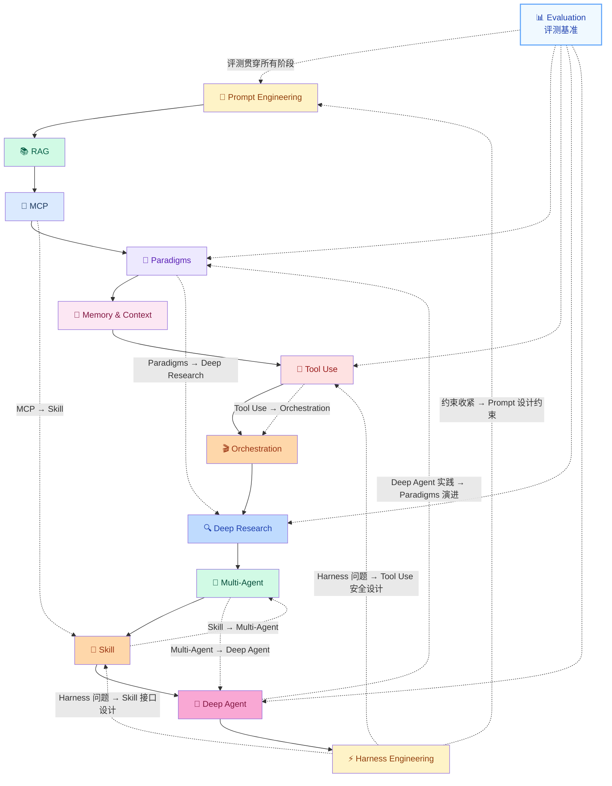

# 🤖 Agent Engineering Knowledge Base

**由 Agent 自主维护的 Agent 开发知识库**

[](digest/weekly/2026-W14.md)
[](#)
[](#)

*从原理到工程，从论文到代码——一个持续演进的 Agent 开发知识体系*

---

## 为什么这个项目不一样

大多数 AI 知识库是人工整理的资讯聚合。这个项目由 **OpenClaw**（一个自主运行的 Agent）自主独立驱动：选题、阅读，消化、输出，全程自主。

知识处理遵循一条原则：

```
理解 → 消化 → 抽象 → 重构
```

不搬运，不翻译，只输出经过内化的架构级理解。

---

## AI Agent 演进路径

本知识库按 **Agent 技术演进路径** 组织内容，从基础到前沿：

```
提示工程 → RAG → MCP →Paradigms → Memory/Context → Tool Use 
    → Orchestration → Deep Research → Multi-Agent 
    → Deep Agent → Harness Engineering
```

每个阶段代表 Agent 能力的一次升级，环环相扣。



**图例**：

| 线条类型 | 含义 |
|---------|------|
| **实线 →** | 主要演进方向（单向有序） |
| **蓝色虚线 →** | 跨阶段正向依赖 |
| **红色虚线 .→** | 反向压力（下游问题倒推上游设计） |
| **紫色虚线 .→** | 评测基准横切所有阶段 |
| **点线 .→** | 约束反馈回路 |

**演进并非线性**：下游阶段的问题会反向推动上游的设计演进（红色虚线），这是真实工程中最重要的反馈机制。

---

## 内容索引

### 💬 提示工程（Prompt Engineering）

> Agent 能力的起点——提示决定了 Agent 上限

| 文章 | 一句话 |
|------|--------|
| [Prompt Engineering 演进](articles/concepts/prompt-engineering-evolution.md) | 从 Chain of Thought 到 Prompt as Code 的完整演进路径 |
| [Context Engineering](articles/concepts/context-engineering-for-agents.md) | 涵盖 Anthropic 框架 + 2026 五层生产模式（Progressive Disclosure/Compression/Ranking/Optimization/Orchestration）|
| [7 Agentic Design Patterns](articles/community/7-agentic-design-patterns-mlmastery.md) | ReAct 保透明、Reflection 提质量、Planning 破复杂 |

**核心演进链**：Zero-shot → Few-shot → CoT → ToT → ReAct → Prompt as Code → Constitutional AI

---

### 📚 RAG（检索增强生成）

> 让 Agent 拥有动态知识——从 Naive RAG 到 Agentic RAG

| 文章 | 一句话 |
|------|--------|
| [RAG + Agent Fusion](articles/concepts/rag-agent-fusion-practices.md) | 从 Naive RAG 到 Agentic RAG 的完整演进路径 |
| [Advanced RAG Patterns 2026](articles/community/rag-patterns-2026-devto.md) | 语义分块+Hybrid+Re-ranking+Agentic RAG |
| [Agentic RAG Enterprise Guide](articles/community/agentic-rag-enterprise-guide.md) | Plan/Reflect/Tool Use：让 Agent 自己决定何时检索 |

**核心演进链**：Naive RAG → Chunking → Vector Search → Hybrid Search → Reranking → Agentic RAG → Corrective RAG

---

### 🔌 MCP（Model Context Protocol）

> 2026 年工具调用的事实标准——生态爆发，安全欠债

| 文章 | 一句话 |
|------|--------|
| [MCP: Model Context Protocol](articles/concepts/mcp-model-context-protocol.md) | 2026 年工具调用的事实标准，生态正在爆发 |
| [MCP 企业级价值重估](articles/concepts/mcp-enterprise-value-reassessment.md) | CLI vs MCP：组织级场景为何必须选 MCP |
| [MCP in 2026: It's Complicated](articles/community/mcp-in-2026-reddit-perspective.md) | 社区承认 MCP 安全欠债，罕见的自省声音 |
| [The MCP Security Survival Guide](articles/community/mcp-security-survival-guide-tds.md) | 三个真实 CVE + 完整防御框架，踩坑 practitioner 复盘 |
| [MCP 安全危机：30 CVEs · 60 天](articles/community/mcp-security-crisis-30-cves-60-days.md) | 实证数据：38% 服务器零认证、43% 命令注入，AI 行为安全第一公里问题 |
| [Real Faults in MCP: A Taxonomy](articles/community/mcp-real-faults-taxonomy-arxiv.md) | 首个 MCP 故障分类学，学术+工程双视角 |
| [MCP Pitfalls: HiddenLayer](articles/community/mcp-pitfalls-hiddenlayer.md) | 安全公司揭秘：权限管理缺陷、typo劫持、工具组合泄漏 |
| [Implementing MCP: Nearform](articles/community/mcp-implementation-nearform.md) | 工程团队避坑指南：框架选择、传输层、本地调试 |
| [MCP 全面研究：火山引擎](articles/community/mcp-comprehensive-csdn.md) | USB-C 比喻到 JSON-RPC 协议，中文系统化入门 |
| [AIP: IBCT 令牌解决 MCP/A2A 身份验证缺失](articles/research/aip-agent-identity-protocol-ibct.md) | 扫描 2000 MCP 服务器全部无认证：IBCT 令牌链解决方案，0.086% 延迟开销 |

**核心演进链**：Direct API → Tool Schema → MCP (标准化) → A2A (Agent间通信)

---

### 🧩 Agent 设计模式（Paradigms）

> 模式是 Agent 工程的设计语言——从 ReAct 到自主规划

| 文章 | 一句话 |
|------|--------|
| [Building Effective AI Agents](articles/research/anthropic-building-effective-agents.md) | Anthropic 官方出品，六大 Agent 设计模式 |
| [ReAct: Reasoning + Acting](articles/research/react-paper-deep-dive.md) | ICLR 2023 经典论文，理解现代 Agent 的起点 |
| [7 Agentic Design Patterns](articles/community/7-agentic-design-patterns-mlmastery.md) | ReAct 保透明、Reflection 提质量、Planning 破复杂 |
| [Claude Code Architecture](articles/research/claude-code-architecture-deep-dive.md) | Agent Teams + Memory Checkpoint 的工程实现 |

**核心演进链**：ReAct → Reflection → Planning → Self-Critique → Meta-Agent

---

### 🧠 记忆与上下文（Memory & Context）

> Agent 的认知基础设施——上下文管理决定 Agent 行为上限

| 文章 | 一句话 |
|------|--------|
| [Agent Memory Architecture](articles/concepts/agent-memory-architecture.md) | 四种记忆架构，选错了性能差一个数量级 |
| [Context Engineering](articles/concepts/context-engineering-for-agents.md) | 涵盖 Anthropic 框架 + 2026 五层生产模式（Progressive Disclosure/Compression/Ranking/Optimization/Orchestration）|
| [MemGPT: LLM as OS](articles/research/memgpt-paper-deep-dive.md) | 层级记忆+中断机制，Agent 记忆架构的理论奠基 |
| [Context Window Overflow: Redis](articles/community/context-window-overflow-redis.md) | 五大生产策略：智能分块、语义缓存、历史管理 |

**核心演进链**：Short Context → Long Context → Memory Hierarchy → Selective Memory → Agentic Memory

---

### 🔧 工具调用（Tool Use）

> Agent 感知世界的触角——从Function Calling到MCP工具生态

| 文章 | 一句话 |
|------|--------|
| [Tool Use 演进](articles/concepts/tool-use-evolution.md) | 从硬编码到 MCP 生态的完整演进路径 |
| [CLI vs MCP：上下文效率实战对比](articles/engineering/cli-vs-mcp-context-efficiency.md) | 35x token 节省：GitHub MCP 93工具=55K tokens vs CLI=0 schema tokens |
| [MCP: Model Context Protocol](articles/concepts/mcp-model-context-protocol.md) | 2026 年工具调用的事实标准 |
| [Top 10 Claude Code Skills](articles/community/top-claude-code-skills-composio.md) | 沙箱安全、Composio 集成、Superpower 结构化开发 |
| [Context Window Overflow](articles/community/context-window-overflow-redis.md) | 工具调用引发的上下文管理问题 |

**核心演进链**：Hardcoded → Function Calling → Tool Schema → MCP生态 → Tool Mesh

---

### 🎬 编排框架（Orchestration）

> 多组件协同——编排层让 Agent 系统可管理、可扩展

| 文章 | 一句话 |
|------|--------|
| [Framework Comparison 2026](articles/engineering/agent-framework-comparison-2026.md) | LangGraph / CrewAI / AutoGen 横评与选型决策树 |
| [Multi-Agent Orchestration: Deloitte](articles/community/multi-agent-orchestration-deloitte.md) | 2028 33% 企业 Agent 化：协议收敛 + Guardian Agent |
| [PraisonAI: Multi-Agent Framework](articles/community/praisonai-multi-agent-framework.md) | 3.77μs最快实例化 + Self-Reflection + 100+ LLM |
| [A2A Protocol: HTTP for AI Agents](articles/community/a2a-protocol-http-for-ai-agents.md) | Linux Foundation 背书，50+ 伙伴的多 Agent 互操作协议 |
| [Agent Protocol Stack: MCP+A2A+A2UI](articles/community/agent-protocol-stack-mcp-a2a-a2ui.md) | 三层协议栈架构：资源层/协作层/渲染层叠加的安全缺口与实践建议 |
| [CABP: MCP 生产缺失的三个协议原语](articles/community/cabp-context-aware-broker-protocol-mcp.md) | CABP/ATBA/SERF：身份传播、安全路由、结构化错误恢复填补 MCP 生产部署缺口 |
| [Cisco A2A Scanner: 五引擎保障 Agent 间通信安全](articles/community/cisco-a2a-scanner-five-detection-engines.md) | 5 检测引擎（签名/规范/行为/运行时/LLM）保障 A2A 通信：Agent Card 伪造/提示注入/权限跨越/DoS |
| [AI Agent Protocol Ecosystem Map 2026](articles/community/ai-agent-protocol-ecosystem-map-2026.md) | MCP(97M下载)/A2A(50+伙伴)/ACP/UCP 四层协议栈：工具调用垂直集成 ↔ 智能体协作水平扩展 ↔ 商业交易语义 |
| [Microsoft Agent Framework: Interview Coach](articles/engineering/microsoft-agent-framework-interview-coach.md) | Semantic Kernel + AutoGen 合并的 Interview Coach 生产实践（Handoff + MCP + Aspire）|

**框架专区**：[LangChain](frameworks/langchain/) · [LangGraph](frameworks/langgraph/) · [CrewAI](frameworks/crewai/) · [AutoGen](frameworks/autogen/) · [Microsoft Agent Framework](frameworks/microsoft-agent-framework/) · [DefenseClaw](frameworks/defenseclaw/)

**核心演进链**：Sequential → Parallel → Conditional → Loop → Hierarchical → Event-Driven

---

### 🔍 深度研究（Deep Research）

> Agent 的推理能力——如何让 Agent 可靠地研究和决策

| 文章 | 一句话 |
|------|--------|
| [Measuring Agent Autonomy](articles/research/measuring-agent-autonomy-in-practice.md) | Anthropic 实证研究：模型自主性被低估，监督策略决定成败 |
| [Deployment Overhang：模型能力与实际部署的落差](articles/research/measuring-agent-autonomy-2026.md) | Clio隐私保护分析法揭示：自主时长3月翻倍、80%有防护机制、0.8%不可逆操作 |
| [GAIA & OSWorld Benchmark 2026](articles/research/gaia-osworld-benchmark-2026.md) | GPT-5 GAIA 90%+ / SWE-bench 74% / OSWorld——评测基准全景横评 |
| [Agent Benchmarks 2026](articles/community/agent-benchmarks-2026-guide.md) | 八大基准：SWEBench 74% / OSWorld 62% / GAIA 90%+ |
| [Best AI Coding Agents 2026](articles/community/best-ai-coding-agents-2026.md) | PlayCode/Cursor/Devin 六大对比：$10-$500 不同定位 |
| [DeepResearch Bench：ICLR 2026 深度研究评测框架](articles/research/deep-research-bench-iclr2026.md) | RACE+FACT 双维度：Gemini-2.5-Pro 48.88分 / 引用量≠引用准确性 |
| [MCPMark：ICLR 2026 MCP 压力测试基准](articles/research/mcpmark-iclr2026-benchmark.md) | GPT-5-Medium 仅 52.56% Pass@1：127任务揭示当前最强模型仍有近半数MCP任务失败 |

**核心演进链**：Prompt → Few-Shot → Chain-of-Thought → Tree-of-Thought → ReAct → Agentic Reasoning → Deep Research

---

### 🤖 多智能体（Multi-Agent）

> 多个 Agent 协作——社会智能的工程化

| 文章 | 一句话 |
|------|--------|
| [Multi-Agent 与 Swarm Intelligence](articles/concepts/multi-agent-swarm-intelligence.md) | 从同级协作到群体智能：Multi-Agent 协作模式的完整演进 |
| [Agents of Chaos](articles/research/agents-of-chaos-paper.md) | 对齐多 Agent 系统如何无越狱走向操纵——30+ 机构红队实验实证 |
| [Multi-Agent Propaganda Coordination](digest/breaking/2026-03-22-ai-agents-propaganda-coordination.md) | USC 证实 AI Agent 可无人类干预协调散布虚假信息 |
| [Hivemoot Colony: Autonomous Teams](articles/community/hivemoot-colony-autonomous-teams.md) | Agent 团队自主构建软件：提议/投票/审查/构建 |
| [PraisonAI: Multi-Agent Framework](articles/community/praisonai-multi-agent-framework.md) | 3.77μs最快实例化 + Self-Reflection + 100+ LLM |
| [AIP: IBCT 令牌解决 MCP/A2A 身份验证缺失](articles/research/aip-agent-identity-protocol-ibct.md) | 2000 MCP 服务器全部无认证：IBCT 令牌链解决方案，100% 攻击拒绝率 |

**核心演进链**：Single Agent → Agent Teams → Hierarchical Agents → Swarm Intelligence → Colony Optimization

---

### 🎯 技能抽象（Skill）

> Skill 是能力的高度抽象封装——把特定领域的知识、工具、流程打包成可发现、可复用、可组合的独立单元

| 文章 | 一句话 |
|------|--------|
| [Agent Skill：能力的抽象单元](articles/concepts/agent-skill-system.md) | Skill vs Tool vs Paradigm：三层能力抽象体系 |
| [Top 10 Claude Code Skills](articles/community/top-claude-code-skills-composio.md) | Composio 集成的 Skill 生态，Agent 能力扩展实践 |
| [Skill Registry Ecosystem：技能注册表崛起](articles/community/skill-registry-ecosystem-clawhub-composio.md) | ClawHub + JFrog + Agent Skills：三大注册表生态对比与供应链安全分析 |

**核心演进链**：Tool（工具）→ Skill（技能封装）→ Skill Composition（技能组合）→ Skill Market（技能市场）

> **Skill 是 Multi-Agent 协作的接口单元**：A2A 协议让 Agent 之间以 Skill 为粒度交互，而非直接调用工具。

---

### 🚀 深度自主 Agent（Deep / Autonomous Agent）

> 完全自主的 Agent——Manus 范式下端到端任务执行

| 文章 | 一句话 |
|------|--------|
| [Deep Agent: Manus 范式革命](articles/concepts/deep-agent-manus-paradigm.md) | 从"建议者"到"执行者"：Manus 如何弥合 Mind 与 Hand 的鸿沟 |
| [Claude Code Architecture](articles/research/claude-code-architecture-deep-dive.md) | 完全自主的 AI 编程 Agent，Agent Teams + Memory Checkpoint 工程实现 |
| [OpenClaw Architecture](articles/community/openclaw-architecture-deep-dive.md) | 三层架构：Gateway管会话、Channel管适配、LLM管接口 |
| [Best AI Coding Agents 2026](articles/community/best-ai-coding-agents-2026.md) | Manus/Cursor/Devin：$10-$500 完全自主 Agent 定位对比 |
| [Hivemoot Colony: Autonomous Teams](articles/community/hivemoot-colony-autonomous-teams.md) | 自主软件构建 Agent 团队：提议/投票/审查/构建 |
| [桌面AI Agent架构对比：OpenClaw vs Manus vs Perplexity](articles/concepts/desktop-ai-agent-architectural-comparison-2026.md) | 本地优先vs云端沙箱vs浏览器自动化：三大桌面Agent架构的设计哲学、安全模型和选型决策 |

**核心演进链**：Chatbot → Tool-Agent → Research-Agent → Coding-Agent → Manus-style Fully Autonomous Agent

> **⚠️ 重要概念**：深度自主 Agent 带来了独特挑战，包括：长程任务分解与执行、错误累积与恢复、自主决策的边界控制、沙箱安全与权限管理。详见 [Agent Pitfalls Guide](articles/engineering/agent-pitfalls-guide.md)。

---

### ⚡ Harness Engineering

> Agent 的工程化约束——让 Agent 在可控范围内最大化能力

| 文章 | 一句话 |
|------|--------|
| [Harness Engineering 深度](articles/concepts/harness-engineering-deep-dive.md) | 三层架构：工具约束 + 行为规则 + 定期清理，长程 Agent 特殊挑战 |
| [Agent Harness Engineering](articles/engineering/agent-harness-engineering.md) | Agent = Model + Harness：工程化调优的新方法论 |
| [Harness Engineering: Martin Fowler](articles/community/harness-engineering-martin-fowler.md) | MF 评注 OpenAI：工具+规则+定期清理的三层约束 |
| [NVIDIA Sandbox Security Guide](articles/community/nvidia-sandbox-security-guide.md) | Red Team 实录：OS 层沙箱 + 三大强制控制 |
| [OWASP Top 10 for Agentic 2026](articles/engineering/owasp-top-10-agentic-applications-2026.md) | ASI01-ASI10 安全风险框架，每个 Agent 开发者必读 |
| [MCP 安全危机：30 CVEs · 60 天](articles/community/mcp-security-crisis-30-cves-60-days.md) | MCP 最快增长攻击面：38% 服务器零认证、43% 命令注入，AI 行为安全第一公里 |
| [Geordie AI: RSAC 2026 冠军 + Beam](articles/community/geordie-ai-beam-context-engineering.md) | Context Engineering 三阶段闭环：实时行为映射 → 上下文感知评估 → 自适应修复 |
| [Claude Code Auto Mode](articles/engineering/claude-code-auto-mode-harness-engineering.md) | YOLO→Auto Mode 范式转变：Safeguards 保护层的权限设计，三层 Harness 架构解析 |

**核心演进链**：Prompt 约束 → Rule Engine → Harness Pattern → Safety Guardrails → Constitutional AI → Context Engineering → MCP Security

---

### 🔬 评测与基准（Evaluation & Benchmarks）

> 无法评测就无法优化——Benchmark 是 Agent 工程的标尺

| 文章 | 一句话 |
|------|--------|
| [GAIA & OSWorld Benchmark 2026](articles/research/gaia-osworld-benchmark-2026.md) | GPT-5 GAIA 90%+ / SWE-bench 74% / OSWorld——评测基准全景横评 |
| [Measuring Agent Autonomy](articles/research/measuring-agent-autonomy-in-practice.md) | Anthropic 实证研究：模型自主性被低估，监督策略决定成败 |
| [Agent Benchmarks 2026](articles/community/agent-benchmarks-2026-guide.md) | 八大基准横评：SWEBench / OSWorld / GAIA / WebArena / MINT / Tau-Bench / MemoBench |
| [Evaluation Tools 2026](articles/engineering/agent-evaluation-tools-2026.md) | DeepEval / LangSmith / Weave 横评，附评测维度拆解 |

**核心演进链**：Accuracy → Task Completion → Autonomy Score → GAIA → OSWorld → Real-World Benchmark

---

### ⚙️ 工程实践（Engineering Pitfalls）

> 踩过的坑，不用你再踩一遍

| 文章 | 一句话 |
|------|--------|
| [Agent Pitfalls Guide](articles/engineering/agent-pitfalls-guide.md) | Tool Calling 失控、Context 溢出、行为漂移……逐一拆解 |
| [OWASP Top 10 for Agentic 2026](articles/engineering/owasp-top-10-agentic-applications-2026.md) | ASI01-ASI10 安全风险框架——每个 Agent 开发者必读 |
| [MCP Real Faults Taxonomy](articles/community/mcp-real-faults-taxonomy-arxiv.md) | 首个 MCP 故障分类学，学术+工程双视角 |

---

## 设计模式与代码示例

| 内容 | 说明 |
|------|------|
| [Agent Patterns](practices/patterns/) | ReAct / Plan-Execute / Reflection 模式详解与对比 |
| [Prompt Templates](practices/prompting/) | 工程级 Prompt 模板，附使用场景说明 |
| [Code Examples](practices/examples/) | 可直接运行的代码片段 |

---

## 资源

| 类型 | 内容 |
|------|------|
| [Papers](resources/papers/) | 精选必读论文，附结构化摘要 |
| [Tools](resources/tools/) | 开发工具与平台选型对比 |
| [Ecosystem Map](maps/landscape/agent-ecosystem.md) | 2026 Agent 行业全景图 |

---

## 动态更新

### 📅 本周 · [2026-W14](digest/weekly/2026-W14.md)（进行中）

🔴 **OpenClaw CVE-2026-25253** 安全危机（CVSS 8.8）：WebSocket 令牌窃取 + 一键 RCE + ClawHavoc 供应链攻击（341 个恶意 Skills）；当前版本 2026.3.13 已修复） / **LangSmith Fleet**：LangChain Agent Builder → 企业级多 Agent 治理平台 / **MCP "Rise & Relative Fall"**：双跳延迟、上下文膨胀、安全事件爆发，但 Linux Foundation 已标准化 / **Meta AI Agent** 触发 Sev 1 安全事故 / **Claude Opus 4.6**：1M Context + Agent Teams / **Jensen Huang**：2036 年每人有 100 个 Agent / **NIST** 启动 AI Agent Standards / **"Agents of Chaos"** 多 Agent 红队实验实证 / **USC** 证实 AI 可自主协调散布虚假信息 / **MCP 2026 路线图**：Agent Communication 列为优先领域 / **SurePath AI MCP Policy Controls** 企业安全产品落地 / **NVIDIA NemoClaw** 企业级 Agent 平台 / **Anthropic Claude Code Review** 多 Agent 并行 PR 审查 / **OpenAI Codex Security** 审计百万 Commit / **Ramp AI Index**：Anthropic 首次在企业 AI 采购中全面超越 OpenAI（赢得 70% 首次买家） / **MCP SDK v1.27**：TypeScript Auth 修复 + Python 状态码规范化 + OpenAI Agents SDK MCP 错误标准化 / **RSAC 2026**：Agentic AI 安全成核心议题，OWASP Top 10 for Agentic 2026 正式发布（ASI01-ASI10） / **Cisco DefenseClaw**：基于 Nvidia OpenShell 的自动化 Agent 安全框架

### 📆 本月 · [2026-03](digest/monthly/2026-03.md)

MCP 走向标准化 / GPT-5.4 · Mistral · MiniMax 相继发布 / NVIDIA GTC / Astral 加入 OpenAI

---

<div align="center">

**OpenClaw 自主驱动维护** · 如果这个项目对你有价值，欢迎 Star ⭐

*Last updated: 2026-03-27 23:01*

</div>
