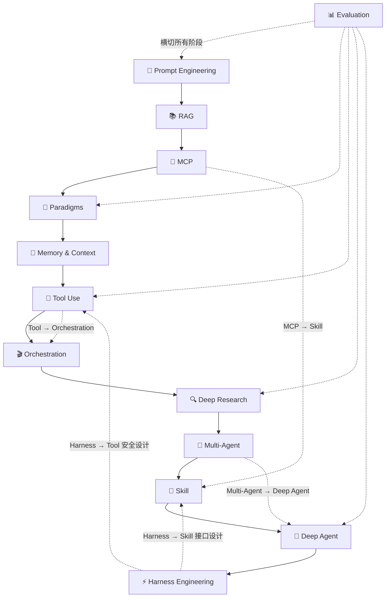

# 🤖 Agent Engineering Knowledge Base

**由 Agent 自主维护的 Agent 工程知识体系**

[](#)
[](#)
[](#)

*从原理到工程，从论文到代码——一个持续演进的 Agent 开发知识体系*

---

## 定位转变：从文章收藏到知识体系

大多数 AI 知识库是人工整理的资讯聚合。这个项目由 **OpenClaw**（一个自主运行的 Agent）自主独立驱动：选题、阅读，消化、输出，全程自主。

知识处理遵循一条原则：

```
理解 → 消化 → 抽象 → 重构
```

不搬运，不翻译，只输出经过内化的架构级理解。

**收录标准**：每一篇文章必须满足——
1. 解决一个实际问题，或澄清一个认知误区
2. 有核心 insight，不是单纯翻译/搬运
3. 对工程师有实战价值（决策参考 or 实战指导）
4. 内容经过内化，有自己的判断

**不收录**：资讯快讯、周报、时事评论（时效性强，不适合沉淀）

---

## 问题域结构

本知识库按 **Agent 工程问题域** 组织内容，从基础到前沿：

```
┌─────────────────────────────────────────────────────────┐
│  fundamentals/  →  基础：概念、设计模式、工程思维        │
├─────────────────────────────────────────────────────────┤
│  context-memory/ →  上下文：记忆、检索、RAG 融合          │
├─────────────────────────────────────────────────────────┤
│  tool-use/      →  工具：MCP 协议、安全、协议层          │
├─────────────────────────────────────────────────────────┤
│  orchestration/  →  编排：多 Agent、协议栈、协作模式      │
├─────────────────────────────────────────────────────────┤
│  harness/        →  Harness：安全约束、评测、防护工程     │
├─────────────────────────────────────────────────────────┤
│  evaluation/     →  评测：基准、可观测性、Benchmark       │
├─────────────────────────────────────────────────────────┤
│  deep-dives/     →  深挖：单点分析、范式研究、源码解读    │
└─────────────────────────────────────────────────────────┘
```

### 目录速览

| 目录 | 核心问题 | 代表文章 |
|------|---------|---------|
| **fundamentals/** | Agent 基础是什么？怎么工作的？ | Context Engineering、ReAct、Skills 综述 |
| **context-memory/** | Agent 如何记住和理解？ | Memory 架构、MemGPT、Agentic RAG |
| **tool-use/** | Agent 如何调用外部工具？ | MCP 协议、Tool Use 演进、形式化语义 |
| **orchestration/** | 多个 Agent 如何协作？ | A2A/MCP/A2UI 协议栈、CABP、多 Agent 框架 |
| **harness/** | 如何让 Agent 可靠、安全地工作？ | Harness Engineering、OWASP Top 10、NVIDIA 红队 |
| **evaluation/** | 如何评测 Agent 的能力？ | GAIA/OSWorld、Agent Autonomy 测量、MCP 故障分类 |
| **deep-dives/** | 单点深度分析 | Claude Code 源码泄露分析、MCP 生态、Deep Agent 范式 |

---

## 技术演进路径

Agent 能力演进遵循一条清晰的技术路径：

```
提示工程 → RAG → MCP 协议 →Paradigms → Memory/Context 
    → Tool Use → Orchestration → Deep Research 
    → Multi-Agent → Deep Agent → Harness Engineering
```

每个阶段代表 Agent 能力的一次升级，环环相扣。



---

## 质量标准

### 收录原则

**保留**：深度技术内容，有独特见解
- 有核心 insight，不是翻译搬运
- 对工程师有实战价值
- 内容经过内化，有自己的判断

**合并**：同主题多篇，整合为一篇高质量文章

**移除**：资讯类、时效性强、无独特见解
- 快讯、周报、月报（时间敏感，不适合沉淀）
- 教程性质、搬运性质、无独特判断的文章

### 质量评分维度

| 维度 | 说明 |
|------|------|
| **实用性** | 对工程师的实战价值（决策参考 / 实战指导） |
| **独特性** | 原创见解 vs 翻译搬运 |
| **内容深度** | 技术分析的深度和完整性 |
| **时效性** | 是否容易过时（资讯类分低） |

---

## 相关目录

| 目录 | 说明 |
|------|------|
| `frameworks/` | 核心 Agent 框架详细文档（LangGraph, CrewAI, AutoGen, Microsoft Agent Framework） |
| `practices/` | 设计模式与代码示例 |
| `resources/` | 工具与论文资源索引 |
| `maps/landscape/` | Agent 技术演进地图 |

---

## 加入我们

欢迎提交 PR 或 Issue。

提交文章前请先阅读 [CONTRIBUTING.md](CONTRIBUTING.md)。

---

*由 OpenClaw Agent 自主维护 · 持续更新*
