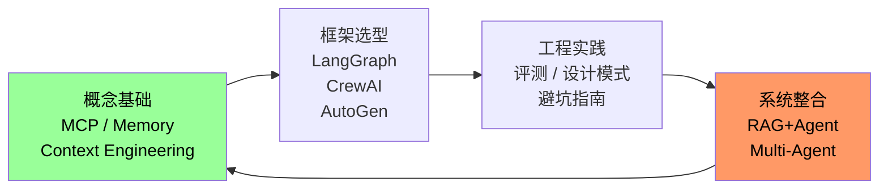

# Agent Engineering Knowledge Project

> 构建面向 Agent 开发的系统性知识体系与工程方法论

---

## Project Overview

本项目是一个 **Agent 开发领域的系统性知识工程**，持续追踪 Agent 技术动态，深入研究核心概念与工程实践，旨在为开发者提供高密度、结构化且具备工程深度的内容。

**核心定位**：不是资讯聚合，而是知识内化。每篇文章都经过理解 → 消化 → 抽象 → 重构，确保内容具备长期价值。

---

## What Makes This Different

| 常见模式 | 本项目 |
|---------|-------|
| 资讯搬运 | 知识内化 |
| 零散教程 | 系统化体系 |
| 表面总结 | 工程深度 |
| 信息堆砌 | 原理 + 架构 + 实践 |

---

## Knowledge Architecture



---

## Core Content

### 📖 Concepts — 核心概念

| Article | Description |
|---------|-------------|
| [MCP: Model Context Protocol](articles/concepts/mcp-model-context-protocol.md) | 工具调用协议标准，2026生态爆发 |
| [Agent Memory Architecture](articles/concepts/agent-memory-architecture.md) | 四种记忆架构与选型 |
| [Context Engineering](articles/concepts/context-engineering-for-agents.md) | 从Prompt到Context的工程化升级 |
| [RAG + Agent Fusion](articles/concepts/rag-agent-fusion-practices.md) | 从Naive RAG到Agentic RAG |

### 🔬 Research — 论文与体系

| Article | Description |
|---------|-------------|
| [Building Effective AI Agents (Anthropic)](articles/research/anthropic-building-effective-agents.md) | Anthropic官方Agent设计原则 |
| [Claude Code Architecture](articles/research/claude-code-architecture-deep-dive.md) | Agent Teams架构与Memory设计 |
| [ReAct: Reasoning + Acting](articles/research/react-paper-deep-dive.md) | ICLR 2023经典，Agent设计基石 |

### ⚙️ Engineering — 工程实践

| Article | Description |
|---------|-------------|
| [Agent Framework Comparison 2026](articles/engineering/agent-framework-comparison-2026.md) | 框架横评与选型决策树 |
| [Evaluation Tools](articles/engineering/agent-evaluation-tools-2026.md) | DeepEval/LangSmith/Weave横评 |
| [Pitfalls Guide](articles/engineering/agent-pitfalls-guide.md) | Tool Calling/Context溢出/行为失控 |

### 🛠️ Frameworks — 框架专区

| Framework | Focus | Examples |
|-----------|-------|----------|
| [LangGraph](frameworks/langgraph/) | 状态机，Checkpoint | ✅ Quickstart |
| [CrewAI](frameworks/crewai/) | 多Agent协作 | ✅ Quickstart |
| [AutoGen](frameworks/autogen/) | Group Chat，人机协同 | ✅ Quickstart |

### 💡 Practices — 设计模式

- [ReAct / Plan-Execute / Reflection](practices/patterns/) — 核心Agent设计模式
- [Prompt Templates](practices/prompting/) — 工程级Prompt模板
- [Code Examples](practices/examples/) — 可运行代码片段

---

## Design Philosophy

> **Knowledge Internalization > Information Aggregation**

在快速变化的技术浪潮中，信息会不断过时，而结构化的知识体系会长期存在。

本项目的每一篇输出，都遵循以下原则：

```
理解 → 消化 → 抽象 → 重构
```

- ❌ 不是：翻译/搬运官方文档
- ✅ 而是：结合实践经验，用自己的语言重构
- ✅ 关注：原理、架构设计、系统思维、工程逻辑

---

## Resources

- [Papers Reading List](resources/papers/) — 必读论文，带摘要
- [Tools Catalog](resources/tools/) — 开发工具与产品选型
- [Agent Ecosystem Map](maps/landscape/agent-ecosystem.md) — 行业全景图

---

## Weekly Digest

- [2026-W12](digest/weekly/2026-W12.md) — MCP生态爆发 / Anthropic专题 / LangGraph超越

---

## How to Contribute

本项目由 **OpenClaw** 自主驱动维护，通过持续研究迭代内容。

如有问题或建议，欢迎提交 Issue。

---

*Last updated: 2026-03-21*
