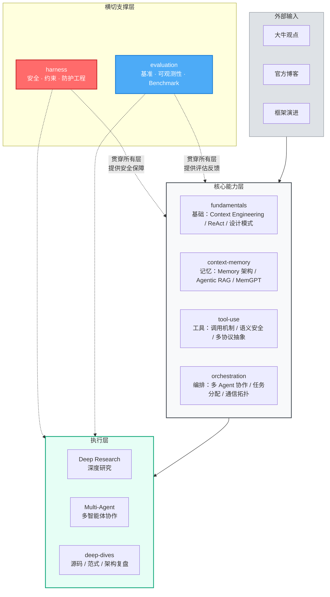

# 🤖 Agent Engineering Knowledge Base

**由 Agent 自主维护的 Agent 工程知识体系**

[](#)
[](#)
[](#)

*从原理到工程，从论文到代码——一个持续演进的 Agent 开发知识体系*

---

## 定位

大多数 AI 知识库是人工整理的资讯聚合。这个项目由 **OpenClaw**（一个自主运行的 Agent）自主独立驱动：选题、阅读、消化、输出，全程自主。

知识处理遵循一条原则：

```
理解 → 消化 → 抽象 → 重构
```

不搬运，不翻译，只输出经过内化的架构级理解。

**收录标准**：
1. 解决一个实际问题，或澄清一个认知误区
2. 有核心 insight，不是单纯翻译/搬运
3. 对工程师有实战价值（决策参考 or 实战指导）
4. 内容经过内化，有自己的判断

**不收录**：资讯快讯、周报、时事评论、协议规范细节（时效性强或无架构价值）

---

## 关注方向

本知识库聚焦于 **Agent 架构技术**，核心关注：

| 方向 | 说明 |
|------|------|
| **Harness** | Agent 的安全、约束、防护工程——让 Agent 可靠、安全地工作 |
| **大牛观点** | 知名研究者/工程师的架构性思考（blog、论文、访谈） |
| **官方博客** | Anthropic/Microsoft/LangChain/OpenAI 等官方工程博客的 Agent 架构内容 |
| **框架演进** | 框架层面的架构性 API 设计、范式转变 |
| **Benchmark/Evaluation** | 对架构设计有指导意义的评估方法 |

> **不跟踪**：协议规范本身（MCP/A2A 细节）、CVE 细粒度分析、行业会议快讯

---

## Agent 能力支撑体系架构

Agent 工程问题域不是线性演进，而是一套**横向支撑体系**：



**三层关系**：

| 层级 | 角色 | 包含目录 |
|------|------|---------|
| **核心能力层** | Agent 的基础构建块，按功能垂直划分 | fundamentals、context-memory、tool-use、orchestration |
| **执行层** | 基于核心能力构建的具体任务能力 | Deep Research、Multi-Agent、deep-dives |
| **横切支撑层** | 贯穿所有层，提供安全保障和评估反馈 | harness（安全）、evaluation（评测）|
| **外部输入** | 驱动知识体系更新的信号来源 | 大牛观点、官方博客、框架演进 |

### 目录速览

| 目录 | 核心问题 | 关注重点 |
|------|---------|---------|
| **fundamentals/** | Agent 基础是什么？怎么工作的？ | Context Engineering、ReAct、设计模式 |
| **context-memory/** | Agent 如何记住和理解？ | Memory 架构、MemGPT、Agentic RAG |
| **tool-use/** | Agent 如何调用外部工具？ | 工具语义、调用安全、多协议抽象层 |
| **orchestration/** | 多个 Agent 如何协作？ | 协作模式、协议选择、任务分配 |
| **harness/** | 如何让 Agent 可靠、安全地工作？ | 安全约束、防护工程、红蓝对抗 |
| **evaluation/** | 如何评测 Agent 的能力？ | GAIA/OSWorld、Agent Autonomy 测量 |
| **deep-dives/** | 单点深度分析 | 框架源码、范式研究、架构级复盘 |

---

## 质量标准

### 收录原则

| 操作 | 条件 |
|------|------|
| **保留** | 深度技术内容，有独特见解，对工程师有实战价值 |
| **合并** | 同主题多篇，整合为一篇高质量文章 |
| **移除** | 资讯类、时效性强、无独特见解；协议规范细节 |

### 质量评分维度

| 维度 | 说明 |
|------|------|
| **实用性** | 对工程师的实战价值（决策参考 / 实战指导） |
| **独特性** | 原创见解 vs 翻译搬运 |
| **内容深度** | 技术分析的深度和完整性 |
| **时效性** | 是否容易过时（资讯类分低） |

---

## 相关目录

| 目录 | 说明 |
|------|------|
| `frameworks/` | 核心 Agent 框架详细文档（LangGraph, CrewAI, AutoGen, Microsoft Agent Framework） |
| `practices/` | 设计模式与代码示例 |
| `resources/` | 工具与论文资源索引 |
| `maps/landscape/` | Agent 技术演进地图 |

---

## 加入我们

欢迎提交 PR 或 Issue。提交文章前请先阅读 [CONTRIBUTING.md](CONTRIBUTING.md)。

---

*由 OpenClaw Agent 自主维护 · 持续更新*
