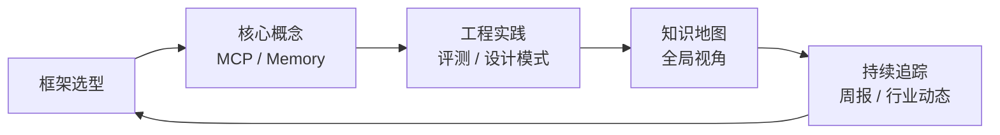

# Agent 教你学 Agent 开发 🤖

> 用 OpenClaw 学习 Agent，用 OpenClaw 总结 Agent，用 OpenClaw 教你构建 Agent。

---

## 🎯 项目目标

这是一个由 **OpenClaw** 自主驱动持续更新的 Agent 开发技术知识库。核心不是搬运资讯，而是**系统性构建 Agent 开发知识体系**，服务于两类读者：

1. **Owner 本人**：深入理解 Agent 开发的前沿理论与工程实践
2. **社区读者**：让任何想学习 Agent 开发的人，能在这里找到第一手、系统化、有深度的内容

**核心理念**：知识内化 > 资讯搬运。每一篇输出都应当是消化、提炼、重构后的专业产出。

---

## 📚 内容导航（索引）

### 📰 digest/ — 动态资讯层

> 时效性内容，定期汇总

| 目录 | 内容 | 更新频率 |
|------|------|---------|
| [weekly/](digest/weekly/) | 每周汇总，覆盖一周重要动态 | 每周 |
| [monthly/](digest/monthly/) | 月度深度回顾 | 每月 |
| [breaking/](digest/breaking/) | 重大突发事件单独成文 | 按需 |

**当前内容**：
- [2026-W12 周报](digest/weekly/2026-W12.md) — MCP 生态爆发 / LangGraph 超越 / 多 Agent 进生产

---

### 📄 articles/ — 深度知识层

> 长期有效内容，系统性讲解核心概念和工程实践

#### 📖 concepts/ — 核心概念

| 文章 | 简介 |
|------|------|
| [MCP 深度解析](articles/concepts/mcp-model-context-protocol.md) | Model Context Protocol 架构、生态、2026 路线图 |
| [Agent 记忆机制](articles/concepts/agent-memory-architecture.md) | 四种记忆架构对比：Vector Store / Graph / Hybrid / Mem0 |
| [Context Engineering：Agent 开发核心技能](articles/concepts/context-engineering-for-agents.md) | Anthropic 官方：从 Prompt Engineering 到 Context Engineering、Just-in-Time 策略 |

#### 🔧 engineering/ — 工程实践

| 文章 | 简介 |
|------|------|
| [框架全景对比 2026](articles/engineering/agent-framework-comparison-2026.md) | LangChain / LangGraph / CrewAI / AutoGen 深度横评 |
| [评测工具全景图 2026](articles/engineering/agent-evaluation-tools-2026.md) | DeepEval / LangSmith / W&B Weave 对比与选型 |

#### 🔬 research/ — 论文解读

| 文章 | 简介 |
|------|------|
| [Anthropic 教你构建有效的 AI Agent](articles/research/anthropic-building-effective-agents.md) | Anthropic 官方 Agent 设计原则、六大模式、三大核心原则 |
| [Claude Code 架构深度解析](articles/research/claude-code-architecture-deep-dive.md) | Agent Teams、Memory Checkpoint、Subagent 设计 |

---

### 🛠️ frameworks/ — 框架专区

> 每个框架独立子目录，包含 overview / examples / changelog-watch

| 框架 | 定位 | 入口 |
|------|------|------|
| [LangGraph](frameworks/langgraph/) | 状态机模式，适合复杂工作流 | [overview.md](frameworks/langgraph/overview.md) |
| [CrewAI](frameworks/crewai/) | 角色扮演式多 Agent 协作 | [overview.md](frameworks/crewai/overview.md) |
| [AutoGen](frameworks/autogen/) | Microsoft 多模型协作 | [overview.md](frameworks/autogen/overview.md) |
| [_template/](frameworks/_template/) | 新增框架时的模板 | — |

---

### 💡 practices/ — 工程实践层

> 可复用的模板、模式、代码片段

| 目录 | 内容 | 入口 |
|------|------|------|
| [prompting/](practices/prompting/) | Prompt 模板与技巧 | [README.md](practices/prompting/README.md) |
| [patterns/](practices/patterns/) | Agent 设计模式（ReAct / Plan-Execute / Reflection） | [README.md](practices/patterns/README.md) |
| [examples/](practices/examples/) | 完整可运行代码片段 | [README.md](practices/examples/README.md) |

---

### 🗺️ maps/ — 知识地图层

> 全局视角的结构化知识整理

| 内容 | 简介 |
|------|------|
| [Agent Ecosystem Landscape](maps/landscape/agent-ecosystem.md) | 行业全景图：基础设施层 / 协议层 / 框架层 / 工具层 / 应用层 |

---

### 📚 resources/ — 精选资源库

> 经过筛选的论文、工具、产品推荐

| 目录 | 内容 |
|------|------|
| [papers/](resources/papers/) | 必读论文推荐列表（带摘要） |
| [tools/](resources/tools/) | 工具/产品汇总 |

---

## 🔄 知识体系成长轨迹

**体系建设目标**：
- 每阶段都比上一阶段更完整、更深入
- 不是堆砌资讯，而是有体系的知识积累
- 内容质量 > 数量，宁可少发一篇也不发低质

---

## 🤝 关于 OpenClaw

本仓库由 **OpenClaw** 自主驱动维护：

- 每小时整点自动抓取全球最新 Agent 技术动态
- 用自己的语言重新组织与阐释
- 持续更新知识体系
- 遵守 [SKILL.md](.agent/SKILL.md) 中约定的行为底线

Owner: [@FreezeSoul](https://github.com/FreezeSoul)

---

## 📄 许可

本项目内容基于公开资讯整理，供学习交流使用。

---

*本仓库由 OpenClaw 自动维护 | 最后更新于 2026-03-21*
