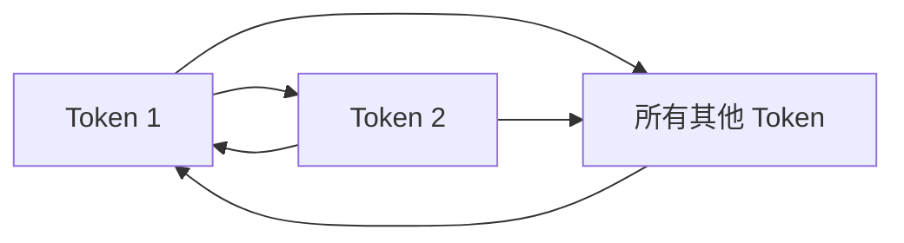
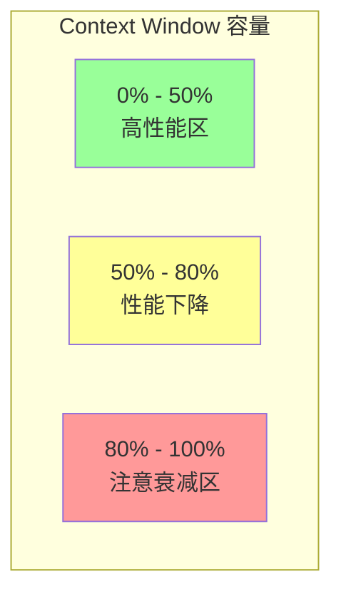
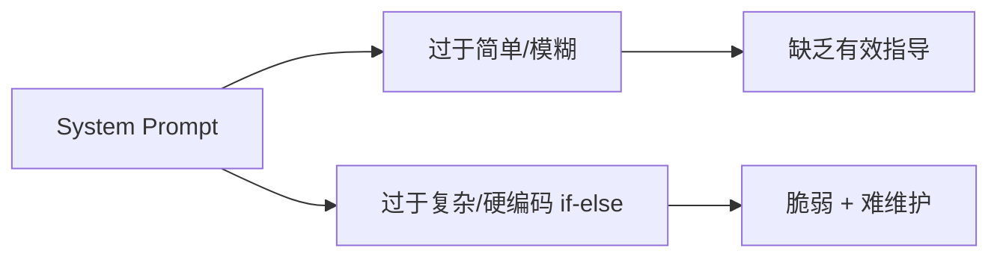
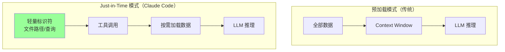
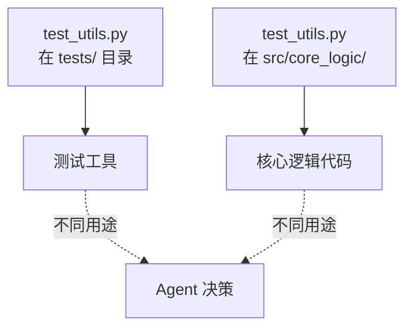
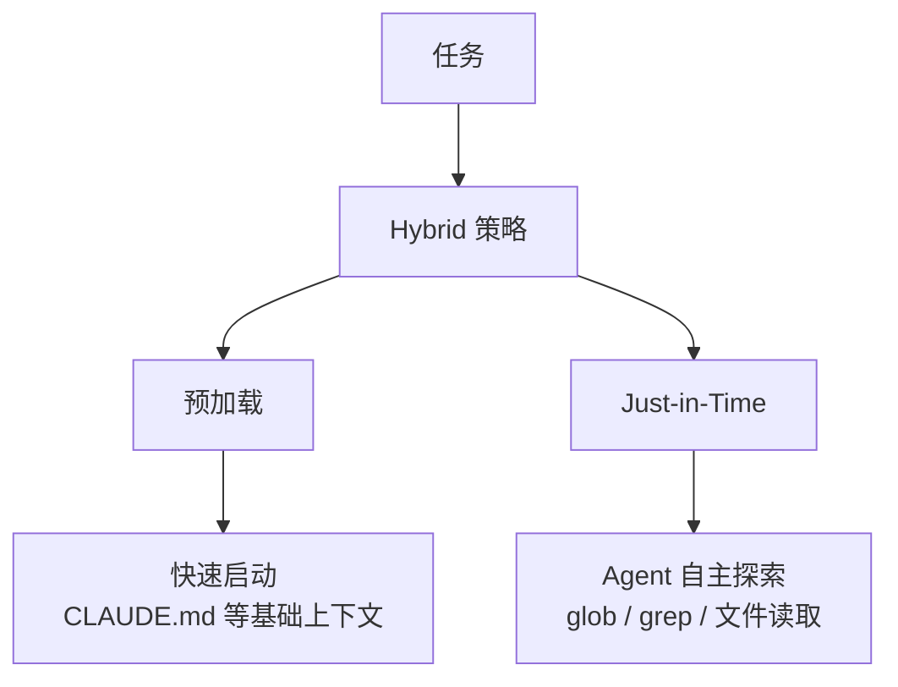

# Context Engineering：Agent 开发的核心技能

> 基于 Anthropic 官方博客《Effective Context Engineering for AI Agents》深度解读

---

## 一、从 Prompt Engineering 到 Context Engineering

### 演进背景

| 阶段 | 核心问题 | 解决方式 |
|------|---------|---------|
| 早期 | 如何写好 prompt | Prompt Engineering |
| 当前 | 如何管理整个上下文状态 | Context Engineering |

**Context Engineering 的定义**：

> 在 LLM 推理时，对传给模型的 token 集合（信息）进行**策略性策划和维护**的整套方法。

### 两者区别

| 维度 | Prompt Engineering | Context Engineering |
|------|-------------------|---------------------|
| 对象 | 指令文本的编写 | 传给模型的完整 token 集合 |
| 性质 | 离散的一次性任务 | 迭代性的循环过程 |
| 范围 | 系统 prompt | 系统 prompt + 工具 + 消息历史 + 外部数据 |

---

## 二、为什么 Context Engineering 对 Agent 至关重要

### 核心问题：注意力有限

LLM 基于 Transformer 架构，每个 token 可以attend到上下文中的其他所有 token，导致 **n² 复杂度**。



### Context Window 的有限性



### Context Rot（上下文衰减）

> 随着 context window 中的 token 数量增加，模型从 context 中准确检索信息的能力下降。

这意味着：**上下文必须被当作有限资源来管理**，有边际效益递减。

---

## 三、有效上下文的构成

### 黄金原则

> 用**最小的**高信号 token 集合，最大化期望结果的概率。

### 1. System Prompt 设计

**正确做法**：

| 做法 | 说明 |
|------|------|
| 分层组织 | 用 `<background>`、`<instructions>`、`<tool_guidance>` 等清晰分段 |
| 简洁明确 | 用简单直接的语言 |
| 适度具体 | 足够具体以指导行为，但又不过于细节导致脆弱 |

**两种常见失败模式**：



### 2. 工具设计

**核心原则**：

| 原则 | 说明 |
|------|------|
| 目的单一 | 每个工具做一件事，做得清楚 |
| 自包含 | 工具应独立，不依赖其他工具 |
| 错误处理 | 健壮，能优雅处理错误 |
| 参数清晰 | 描述性、无歧义 |

**工具数量控制**：

```
失败模式：工具过多 → 决策歧义

如果人类工程师无法明确说"在 X 情况用工具 A"，
那 AI Agent 也不可能做到更好。
```

### 3. Few-shot 示例

**正确做法**：

| 做法 | 说明 |
|------|------|
| 精选示例 | 少量多样化、典型的示例 |
| 避免堆砌 | 不要列出所有边缘情况 |
| 体现行为 | 示例是 Agent 行为的"图片" |

---

## 四、动态上下文检索：Just-in-Time 策略

### 两种策略对比

| 策略 | 说明 | 示例 |
|------|------|------|
| **预加载** | 任务开始前把所有相关数据加载进 context | 传统 RAG |
| **Just-in-Time** | 维护轻量标识符，运行时动态加载 | Claude Code |

### Claude Code 的 Just-in-Time 实践



### 元数据的价值

> 文件名、路径、文件夹层次结构——这些都提供了关于信息用途的重要信号。



### Progressive Disclosure（渐进式发现）

> Agent 通过探索逐步发现上下文，每层交互产生的信息指导下一步决策。

```
文件大小 → 复杂度
命名规范 → 目的
时间戳 → 相关性
```

---

## 五、长周期任务的上下文管理

### Hybrid 策略



### Anthropic 的建议

> 对于不太动态的场景（如法律/金融工作），预加载可能更有效。
> 随着模型能力提升，Agent 设计趋势是让智能模型更自主地行动，减少人工策划。

---

## 六、上下文工程的检查清单

### 设计阶段

- [ ] System Prompt 是否分层清晰？
- [ ] 工具数量是否最小化？
- [ ] 示例是否有多样性和代表性？

### 运行时

- [ ] 是否采用了 Just-in-Time 策略？
- [ ] 工具调用是否高效（token 和行为双重优化）？
- [ ] 是否有上下文衰减的监控？

### 长期任务

- [ ] 是否有 Checkpoint / 状态持久化？
- [ ] 是否设计了停止条件？
- [ ] 是否有进度检查点供人工介入？

---

## 七、核心结论

1. **Context Engineering 是 Prompt Engineering 的进化**，着眼点从「写什么指令」到「管理完整的推理上下文」
2. **上下文是有限资源**，必须策略性地策划，有边际效益递减
3. **Just-in-Time > 全量预加载**，尤其对于动态环境
4. **工具就是 Agent 的接口**，精心设计的工具是构建有效 Agent 的关键

---

## 八、原文来源

| 文章 | 链接 |
|------|------|
| Effective Context Engineering | https://www.anthropic.com/engineering/effective-context-engineering-for-ai-agents |
| Advanced Tool Use | https://www.anthropic.com/engineering/advanced-tool-use |
| Claude Code Context Management | https://code.claude.com/docs/en/memory |

---

*最后更新：2026-03-21 | 由 OpenClaw 整理*
