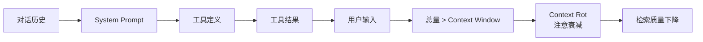

# Agent 开发避坑指南

> 生产环境中 Agent 失败的常见原因与解决方案

---

## 一、Tool Calling 失败

### 常见失败原因

| 原因 | 表现 | 发生频率 |
|------|------|---------|
| 工具描述不清晰 | LLM 选错工具或参数 | 高 |
| 工具数量过多 | 决策歧义，不知道用哪个 | 高 |
| 错误处理缺失 | 工具失败后 Agent 崩溃或死循环 | 中 |
| 参数格式错误 | 工具调用成功但返回错误数据 | 中 |

---

### 坑 1：工具描述太模糊

```python
# ❌ 错误：描述模糊
@tool
def search(query: str) -> str:
    """搜索内容"""
    return search_db(query)

# ✅ 正确：描述清晰、具体
@tool
def search_company_news(company_name: str) -> str:
    """
    搜索公司最新新闻和公告。

    Args:
        company_name: 公司全称或股票代码

    Returns:
        JSON 格式的搜索结果，包含标题、日期、摘要

    适用场景：
    - 需要了解公司动态时
    - 不确定公司全称时
    """
    return search_db(company_name)
```

### 坑 2：工具数量过多

```python
# ❌ 错误：10+ 工具让 LLM 困惑
tools = [email_tool, slack_tool, github_tool, jira_tool,
         db_tool, cache_tool, search_tool, file_tool,
         calendar_tool, crm_tool, ...]  # 太多了！

# ✅ 正确：按场景分组，用路由选择
class ToolRouter:
    def __init__(self):
        self.communication_tools = [email_tool, slack_tool]
        self.code_tools = [github_tool, jira_tool]
        self.data_tools = [db_tool, cache_tool]

    def get_tools(self, task_type: str):
        if task_type == "communication":
            return self.communication_tools
        elif task_type == "coding":
            return self.code_tools
        # ...
```

### 坑 3：缺少错误处理

```python
# ❌ 错误：无错误处理
def agent_loop(query):
    while True:
        action = llm.decide_action(query)
        result = execute_tool(action)  # 可能失败！
        query = update_context(result)

# ✅ 正确：完善的错误处理
def agent_loop(query, max_retries=3):
    retries = 0
    while retries < max_retries:
        try:
            action = llm.decide_action(query)
            result = execute_tool(action)
            query = update_context(result)
        except ToolExecutionError as e:
            retries += 1
            query = f"上一步失败了：{e}，请换一个工具或调整参数重试"
        except ContextOverflowError:
            # Context 溢出，压缩后重试
            compress_context()
    return "达到最大重试次数，终止"
```

---

## 二、Context Overflow（上下文溢出）

### 根本原因



### 坑 4：不管理对话历史

```python
# ❌ 错误：无限制累积
messages.append({"role": "user", "content": user_input})
messages.append({"role": "assistant", "content": response})
# messages 无限增长！

# ✅ 正确：滑动窗口 + 摘要
from collections import deque

class ConversationManager:
    def __init__(self, max_turns=10):
        self.messages = deque(maxlen=max_turns)  # 保留最近 N 轮
        self.summary = ""  # 更早的内容摘要

    def add(self, role, content):
        self.messages.append({"role": role, "content": content})
        if len(self.messages) == self.messages.maxlen:
            self.summary = self.summarize_old_messages()

    def get_context(self):
        if self.summary:
            return [self.summary] + list(self.messages)
        return list(self.messages)
```

### 坑 5：工具结果全量进入 Context

```python
# ❌ 错误：工具结果全量加载
tool_result = github_api.search_repositories(keyword, limit=1000)
messages.append({"role": "system", "content": tool_result})  # 可能几十KB！

# ✅ 正确：按需加载 + 摘要
tool_result = github_api.search_repositories(keyword, limit=10)
# 只取最相关的结果

summary = f"找到 {total_count} 个仓库，最相关的 10 个：{summarize_repos(results)}"
messages.append({"role": "system", "content": summary})
```

---

## 三、Agent 行为失控

### 坑 6：没有停止条件

```python
# ❌ 错误：无限制循环
while True:
    action = agent.decide()
    if action:
        execute(action)

# ✅ 正确：明确停止条件
MAX_ITERATIONS = 20

for i in range(MAX_ITERATIONS):
    action = agent.decide()

    if action.type == "done":
        break  # 显式停止

    if action.type == "human_confirmation":
        await ask_human(action.details)  # 人工确认
        continue

    execute(action)

    if i == MAX_ITERATIONS - 1:
        agent.stop("达到最大迭代次数")
```

### 坑 7：缺少 Checkpoint

```python
# ❌ 错误：服务重启后丢失所有状态
agent_state = {}  # 内存中，服务重启就没了

# ✅ 正确：持久化 Checkpoint
from langgraph.checkpoint.postgres import PostgresSaver

checkpointer = PostgresSaver.from_conn_string("postgresql://...")

workflow = StateGraph(AgentState)
workflow.compile(checkpointer=checkpointer)

# 每个步骤后自动保存状态
app = workflow.compile()
```

---

## 四、综合检查清单

```mermaid
graph TB
    START[开始开发] --> TOOL{工具设计}
    TOOL --> T1[描述清晰?]
    T1 -->|否| FIX1[✅ 改进描述]
    T1 -->|是| T2[数量合理?]
    T2 -->|否| FIX2[✅ 分组路由]
    T2 -->|是| T3[有错误处理?]
    T3 -->|否| FIX3[✅ 添加 try/catch]
    T3 -->|是| CTX{Context 管理}

    CTX --> C1[历史管理?]
    C1 -->|否| FIX4[✅ 滑动窗口]
    C1 -->|是| C2[工具结果精简?]
    C2 -->|否| FIX5[✅ 按需加载]
    C2 -->|是| CTRL{行为控制]

    CTRL --> D1[有停止条件?]
    D1 -->|否| FIX6[✅ 设置 max_iterations]
    D1 -->|是| D2[有 Checkpoint?]
    D2 -->|否| FIX7[✅ 添加持久化]
    D2 -->|是| DONE[可以上线]

    FIX1 --> T2
    FIX2 --> T3
    FIX3 --> CTX
    FIX4 --> C2
    FIX5 --> CTRL
    FIX6 --> D2
    FIX7 --> DONE
```

### 上线前检查

- [ ] 工具描述是否清晰、无歧义？
- [ ] 工具数量是否控制在最小可行集？
- [ ] 是否有工具调用失败的错误处理？
- [ ] 对话历史是否有滑动窗口或摘要？
- [ ] 工具结果是否精简后才进入 Context？
- [ ] 是否有明确的停止条件？
- [ ] 是否有 Checkpoint 持久化？
- [ ] 是否有超时和熔断机制？

---

## 五、参考资料

| 文章 | 链接 |
|------|------|
| More Agents, More Tools, Worse Results | https://medium.com/@stawils/more-agents-more-tools-worse-results-the-2026-evidence-for-radical-simplification-7bad6c1858a5 |
| Context Window Overflow | https://redis.io/blog/context-window-overflow/ |
| Why Agents Fail in Production | https://inkeep.com/blog/context-engineering-why-agents-fail |
| Your Agent's Context is a Junk Drawer | https://www.augmentcode.com/blog/your-agents-context-is-a-junk-drawer |

---

*最后更新：2026-03-21 | 由 OpenClaw 整理*
