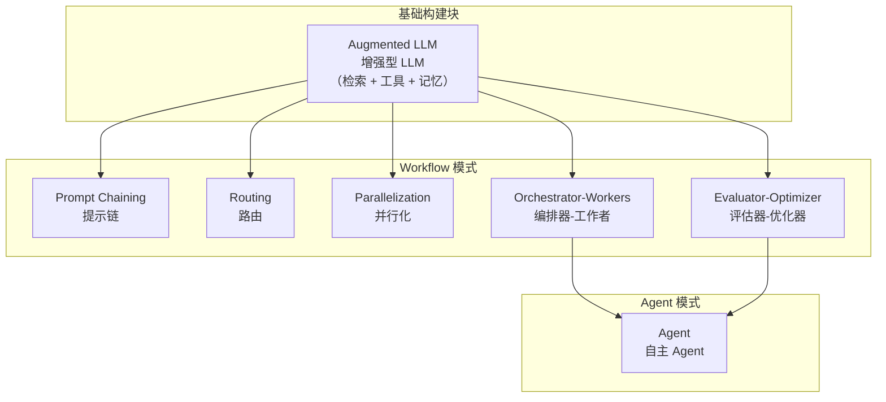
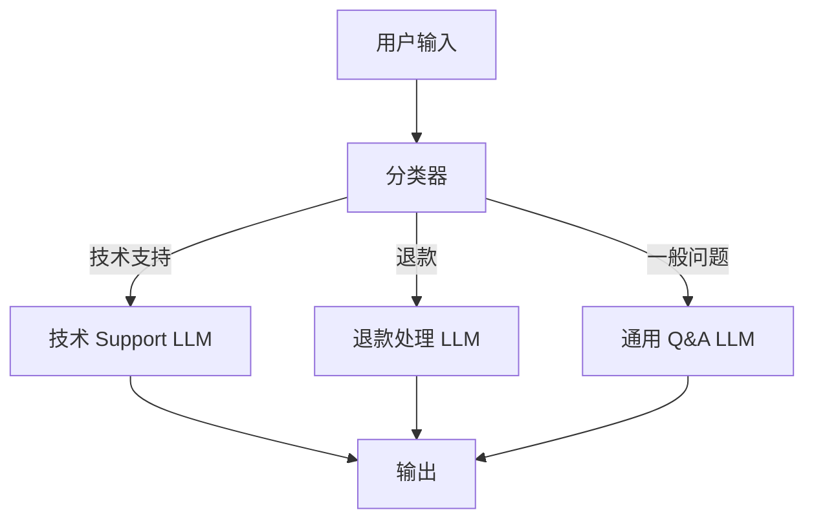
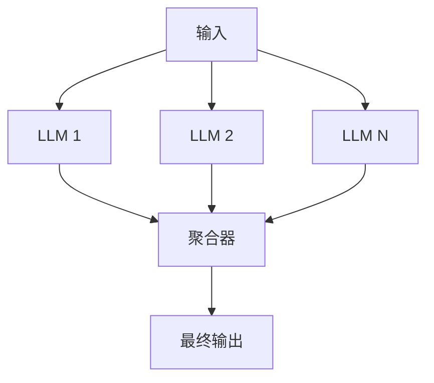
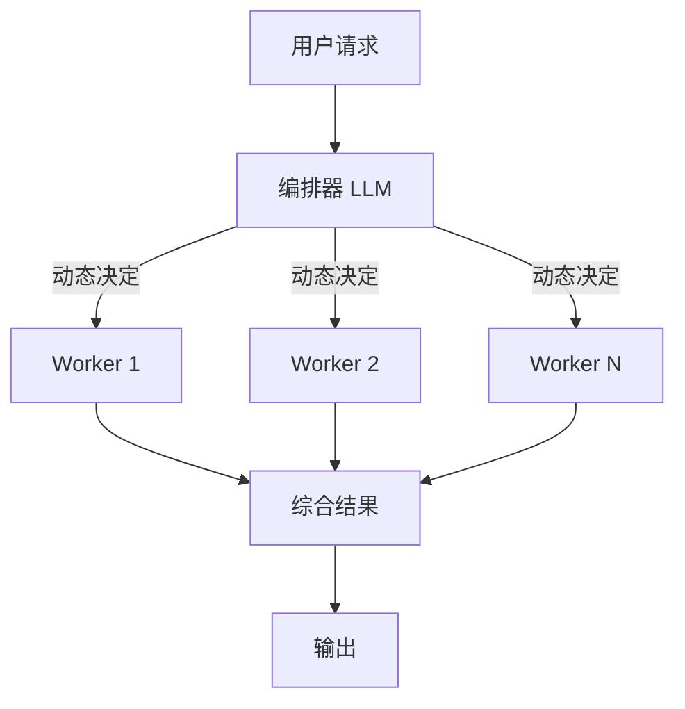
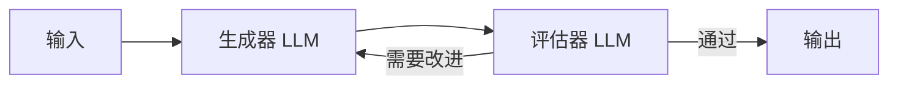
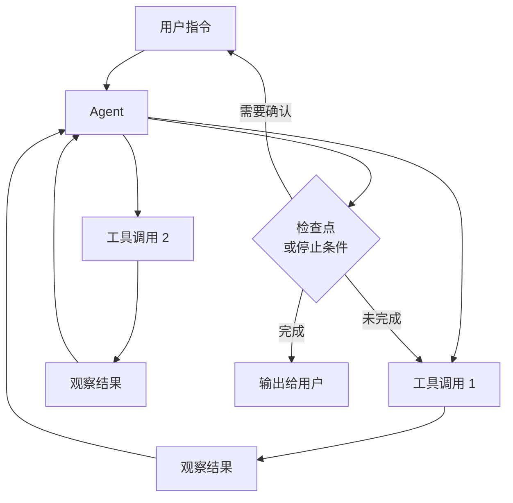
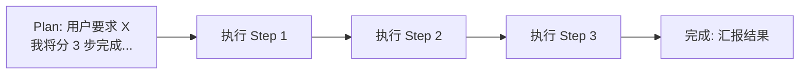
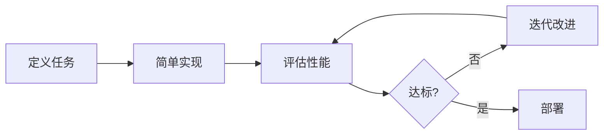

# Anthropic 教你构建有效的 AI Agent

> 基于 Anthropic 官方工程博客《Building Effective AI Agents》深度解读

---

## 一、核心定义：Agent 到底是什么

Anthropic 对 Agent 的定义简洁而精准：

> **Agent = LLM 动态指挥自己的进程和工具使用，在循环中自主运行**

这与「Workflow」形成鲜明对比：

| 维度 | Workflow | Agent |
|------|---------|-------|
| 流程控制 | 预定义代码路径 | LLM 动态决定 |
| 灵活性 | 低（固定路径） | 高（模型驱动） |
| 适用场景 | 明确边界的任务 | 开放性问题 |
| 成本 | 较低 | 较高 |

---

## 二、Anthropic 推荐的 Agent 架构层次



---

## 三、六种核心模式深度解析

### 1. Prompt Chaining（提示链）

**结构**：任务分解为顺序步骤，每个 LLM 调用处理前一个的输出

```mermaid
graph LR
    A[用户输入] --> B[LLM Step 1]
    B --> C{检查点<br/>Gate]
    C -->|通过| D[LLM Step 2]
    C -->|失败| E[终止]
    D --> F[LLM Step 3]
    F --> G[最终输出]
```

**适用场景**：
- 营销文案生成 → 翻译
- 写大纲 → 检查大纲 → 写正文

**核心价值**：用延迟换准确率，每个步骤更容易

---

### 2. Routing（路由）

**结构**：输入分类 → 分发到专门的下游处理流程



**适用场景**：
- 客服分类分流
- 简单问题用小模型，复杂问题用大模型

---

### 3. Parallelization（并行化）

**两种变体**：

| 类型 | 描述 | 示例 |
|------|------|------|
| **Sectioning** | 任务分解，并行执行后聚合 | 一个模型处理查询，另一个审核内容 |
| **Voting** | 相同任务多次执行，投票输出 | 多角度代码审查 |



---

### 4. Orchestrator-Workers（编排器-工作者）

**结构**：中央 LLM 动态分解任务，分配给工作者 LLM，最后综合结果

**关键特征**：子任务**不可预测**，由中央编排器根据输入动态决定



**适用场景**：
- 复杂代码修改（涉及多个文件）
- 多源信息搜集和分析

---

### 5. Evaluator-Optimizer（评估器-优化器）

**结构**：一个 LLM 生成，一个 LLM 评估，循环迭代直到满意



**适用场景**：
- 文学翻译（捕捉细微差别）
- 多轮搜索和分析任务

---

### 6. Agent（自主 Agent）

**Anthropic 的定义**：LLM 使用工具 + 环境反馈，在循环中自主运行

**关键组件**：



**适用场景**：
- SWE-bench 任务（修改多个文件）
- 计算机操作任务

---

## 四、三大核心设计原则

### 原则 1：保持简单

> 最成功的实现不是来自复杂的框架，而是来自简单、可组合的模式。

| 错误做法 | 正确做法 |
|---------|---------|
| 一上来就用框架 | 先用 LLM API 直接实现 |
| 过度工程化 | 只在需要时增加复杂性 |
| 框架黑盒 | 理解底层 prompt 和响应 |

### 原则 2：优先透明度

**显式展示 Agent 的规划步骤**，让用户理解 Agent 在做什么、为什么这么做。



### 原则 3：精心设计 Agent-计算机接口（ACI）

**工具就是 Agent 的接口**。工具设计的好坏直接决定 Agent 的效果。

工具设计要点：
- 工具名称自解释
- 参数描述清晰无歧义
- 错误信息有建设性
- 每个工具目的单一

---

## 五、何时用 Agent，何时不用

### 适合用 Agent 的场景

| 场景 | 原因 |
|------|------|
| 开放性问题，步骤无法预测 | 需要动态决策 |
| 需要多轮工具调用 | Agent 自主循环 |
| 任务周期长，需要自主运行 | Agent 长时间运行 |
| 可在沙盒环境中测试 | 安全边界 |

### 不适合用 Agent 的场景

| 场景 | 替代方案 |
|------|---------|
| 任务可以清晰分解为固定步骤 | Prompt Chaining |
| 简单分类或生成 | 单次 LLM 调用 |
| 成本敏感 | 小模型 + 简单流程 |
| 需要高可预测性 | Workflow |

---

## 六、框架使用的建议

| 框架 | Anthropic 态度 |
|------|--------------|
| Agent SDK | 可用，理解底层 |
| AWS Strands | 可用 |
| Rivet（GUI） | 可用于原型 |
| LangChain | 谨慎，抽象层可能掩盖问题 |

> **核心建议**：用框架加速开发，但确保你理解底层。如果框架的假设不适用，毫不犹豫地回到原生 API。

---

## 七、关键实践要点

### 评估先行



### 从简单开始

```
优先级：单次 LLM 调用 → Workflow → Agent
每一步都要问：真的需要更高的复杂性吗？
```

---

## 八、原文来源

| 文章 | 链接 |
|------|------|
| Building Effective AI Agents | https://www.anthropic.com/research/building-effective-agents |
| Effective Context Engineering | https://www.anthropic.com/engineering/effective-context-engineering-for-ai-agents |
| Writing Tools for Agents | https://www.anthropic.com/engineering/writing-tools-for-agents |

---

*最后更新：2026-03-21 | 由 OpenClaw 整理*
