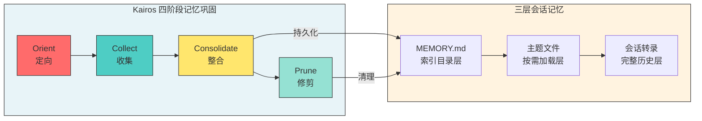
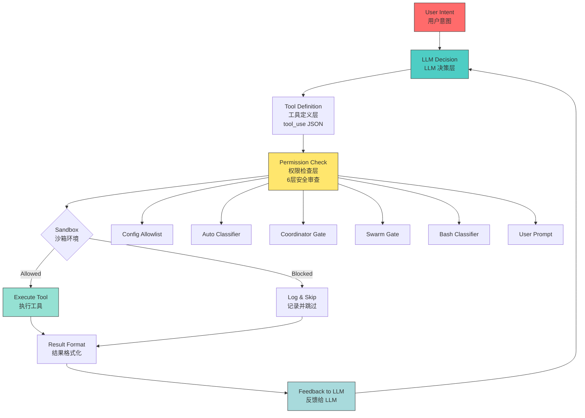
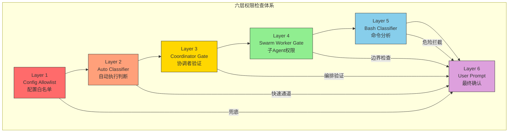
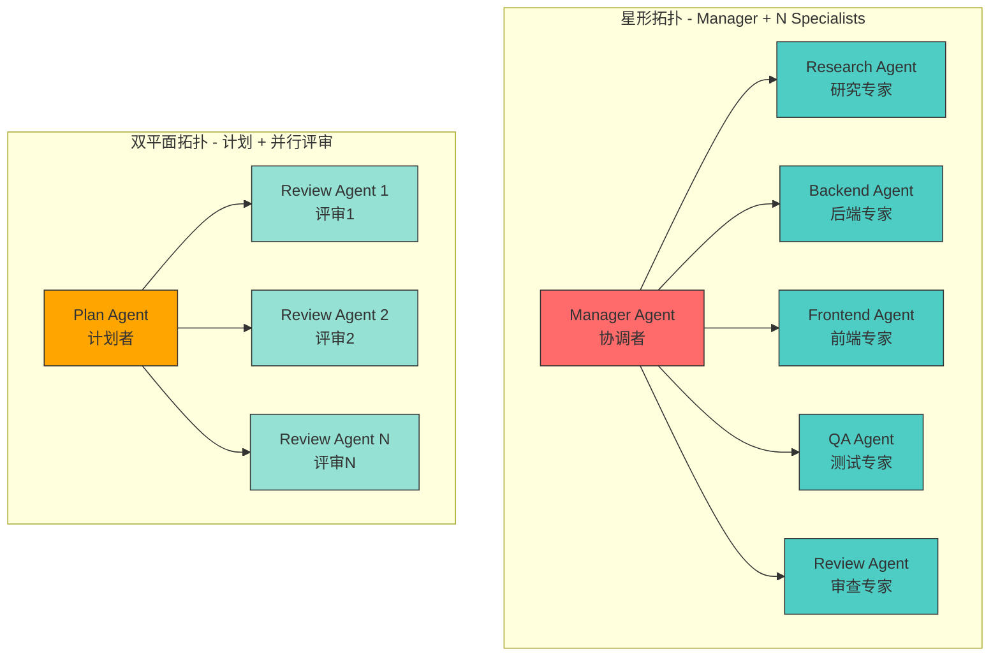
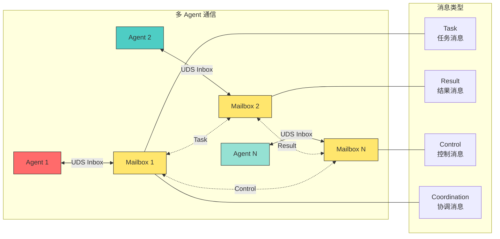
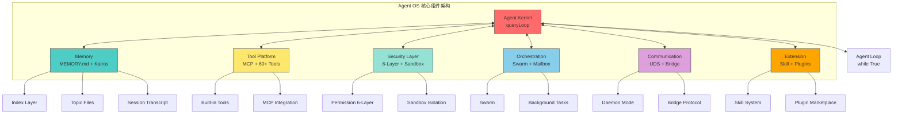

# Claude Code 架构深度解析：从泄露源码透视生产级 AI Agent 的工程真相

> 本文基于 2026 年 3 月 31 日 Claude Code v2.1.88 意外泄露事件中流出的 512,000 行 TypeScript 源码（1,906 个文件），从纯技术视角深入剖析这一生产级 AI Agent 的核心架构设计。

---

## 第一部分：背景与概述

### 1.1 泄露事件的技术意义

2026 年 3 月 31 日，Anthropic 在向 npm 仓库发布 Claude Code v2.1.88 时，一次构建配置错误导致一个 59.8MB 的 JavaScript Source Map 文件（cli.js.map）被一同打包发布。该文件未经任何混淆或压缩，包含了完整的 TypeScript 源码。

事件本身固然尴尬，但真正引起业界震动的，是这份源码第一次向外界完整揭示了**生产级商业 AI Agent 的工程架构**。不同于学术论文中的toy example或开源项目的简化实现，这是一套运行在数百万开发者机器上、经过真实生产环境验证的完整系统。

社区的反应几乎是立竿见影的：GitHub 上迅速出现了多个镜像仓库，其中 instructkr/claude-code 在数小时内就积累了两万多颗星。Anthropic 随即向 GitHub 发送 DMCA 删除请求，但代码早已四处传播。这场事件被社区称为"AI 界的圣诞节"——一个以安全著称的公司，却因为一个低级配置错误将自己的看家本领暴露无遗。

### 1.2 512K 行代码揭示的工程规模

**数字本身会说话。** 512,000 行 TypeScript 代码、1,906 个源文件——这个规模意味着什么？

首先，这不是一个"小脚本包装 LLM"的简单项目。Anthropic 为 Claude Code 投入了实质性的工程力量。从源码结构来看，系统被分解为多个独立维护的包（packages），涵盖了从核心 query engine 到 UI 层、安全层、记忆系统、多 Agent 协作等完整维度。

**代码量级的工程隐喻：**

| 维度 | Claude Code | 典型开源 Agent 项目 |
|------|------------|------------------|
| 代码行数 | ~512,000 LOC | 通常 5,000-50,000 LOC |
| 源文件数 | 1,906 个 | 通常 50-200 个 |
| 内置工具数 | 20+ 默认 / 60+ 总计 | 通常 5-15 个 |
| 安全层级 | 6 层 | 通常 1-2 层 |
| 功能开关数 | 44+ | 通常 0-5 个 |

这组数字揭示了一个核心事实：**Claude Code 的竞争优势并不在于模型本身**（虽然模型无疑很优秀），而在于围绕模型构建的那一层精密的"工程护城河"。Sebastian Raschka 在分析泄露代码后明确指出："Claude Code 相比网页版 Claude 的优势不在于更好的模型，而在于围绕模型构建的软件基础设施——代码库上下文加载、专用工具调度、缓存策略以及子 Agent 协作。"

### 1.3 泄露源码的构成

从源码结构分析来看，泄露的主要是 **Claude Code CLI 的 TypeScript 源码**，而非模型权重或用户数据。构成包括：

- **核心引擎**：queryLoop、callModel、工具调度等核心逻辑
- **安全系统**：6 层权限检查、沙箱隔离、命令分类器
- **记忆系统**：三层会话记忆、Kairos 持久化记忆
- **多 Agent 系统**：Subagent 生命周期管理、Swarm 编排、Mailbox 通信
- **工具层**：文件系统操作、Bash 执行、Web 获取、Notebook 编辑等
- **UI 层**：终端界面、权限确认界面、设置面板
- **44+ 未发布功能**：各种 feature flag 背后的实验性功能

Anthropic 的官方回应确认这是一次内部开发人员的配置错误，而非主动泄露。但无论如何，这次事件为 AI Agent 开发者社区提供了一份罕见的学习样本。

---

## 第二部分：核心架构分析

### 2.1 Query Engine 与 Agent Loop 机制

Claude Code 的心脏是一个极其简洁但极其强大的 **queryLoop()** 函数，位于 query.ts 文件的第 241 行。在这个函数内部，第 307 行有一个 `while(true)` 循环，驱动着整个 Agent 的运转。

理解这个架构的关键在于把握一个核心理念：**LLM 决定做什么，程序决定是否允许做，然后程序去执行。**

**queryLoop 的执行流程：**

```mermaid
flowchart TD
    subgraph queryLoop["queryLoop() - Agent Core Loop"]
        A[Start: while True] --> B[callModel&#40;&#41;]
        B --> C[LLM Returns<br/>text + tool_use]
        C --> D{Parse tool_use}
        D -->|No tools| E[Display text to user]
        D -->|Has tools| F[For each tool]
        F --> G[Permission Check<br/>6-Layer Review]
        G --> H{Sandbox Execution}
        H -->|Allowed| I[Execute Tool]
        H -->|Blocked| J[Log & Skip]
        I --> K[Format Result]
        J --> K
        K --> L[Append to conversation]
        L --> B
        E --> M{Continue?}
        E -->|Yes| B
        E -->|No| N[End]
    end
    
    style A fill:#ff6b6b,stroke:#333
    style B fill:#4ecdc4,stroke:#333
    style G fill:#ffe66d,stroke:#333
    style I fill:#95e1d3,stroke:#333
    style N fill:#a8dadc,stroke:#333
```



这本质上是一个**受约束的 ReAct 模式**——不是 LLM 说了算，而是 LLM 提建议，程序做审查，程序执行后结果再喂回给 LLM。

**这个设计的力量在于：**

LLM 是策略层（policy layer），它理解用户意图、知道要做什么；程序是执行层（execution layer），它决定是否允许做这件事以及如何安全地执行。这种分离使得：
- 安全策略可以独立于模型更新
- 工具执行可以跨模型复用
- 调试和可观测性变得可行

### 2.2 上下文压缩与记忆系统

Claude Code 的记忆系统是其最复杂的子系统之一，泄露源码揭示了一个**三层架构**加上一个**四阶段持久化 pipeline**。

**三层会话记忆设计：**

**第一层：MEMORY.md 索引层**

这不是传统的记忆文件，而是一个**索引目录**。MEMORY.md 的内容本身只包含指向其他知识文件的引用，类似于一本书的目录。LLM 通过这个索引了解"我有哪些知识可以访问"，而不是把全部知识都塞进上下文。

```markdown
# Memory Index

## 项目架构
- 架构决策记录 → @architecture/decisions/
- 模块依赖图 → @architecture/dependencies/

## 业务逻辑
- 支付流程 → @business/payments/
- 用户认证 → @business/auth/

## 技术债务
- 待重构模块 → @techdebt/
```

这种设计的精妙之处在于它实现了**懒加载（lazy loading）**：只有当需要某块知识时，才将其加载到上下文，而不是在每次对话开始时就加载全部历史。

**第二层：按需加载的主题文件**

当 LLM 决定需要某个主题的知识时，系统会从 `.claude/` 目录中加载对应的主题文件。这些文件包含了该领域的背景知识、约定俗成和操作规范。主题文件是结构化的，包含 frontmatter 元数据，使 LLM 能够快速判断文件相关性。

**第三层：完整会话转录**

第三层是会话本身的完整记录。Claude Code 维护了一个完整的对话历史，当需要搜索或引用之前的交互时，可以检索这段历史。更重要的是，5 种类别的**压缩（Compaction）**机制在这里发挥作用——系统会周期性地将长对话压缩为摘要，以控制上下文增长。

**Kairos：跨会话持久化记忆**

源码中发现的 KAIROS 功能标志揭示了一个更深层的记忆系统，这是一个四阶段记忆巩固 pipeline：



- **Orient（定向）**：扫描当前上下文，识别什么内容是重要的
- **Collect（收集）**：从会话中提取事实、决策和模式
- **Consolidate（整合）**：将新记忆与长期存储合并
- **Prune（修剪）**：丢弃过时或低价值的记忆

这个系统不仅服务于个人用户，还支持**团队记忆路径**——一个团队的所有 Claude Code 实例可以共享记忆，这意味着一个项目的 AI 助手积累的知识可以被团队其他成员复用。

**Compaction 的 5 种类型：**

Claude Code 实现了 5 种不同的上下文压缩策略，这是一个经过精心设计的系统，针对不同类型的上下文膨胀有不同的优化手段：

1. **消息压缩**：将连续的用户消息和 AI 回复合并为更简洁的摘要
2. **工具结果压缩**：对于重复工具调用的结果，去除冗余信息
3. **文件引用压缩**：对于大型文件读取，保留关键部分并摘要其余
4. **系统提示压缩**：对系统级指令进行精简，移除已过时的指示
5. **跨会话压缩**：将长期项目上下文压缩为更精简的形式

这种多维度的压缩策略确保了即使在长时间复杂任务中，Claude Code 也能保持上下文窗口的高效利用。

### 2.3 工具链的分层设计

Claude Code 的工具系统远非"直接调用 shell 命令"那么简单，而是一个经过深思熟虑的**分层架构**。

**默认启用的工具（约 20 个）：**

| 工具类型 | 工具名称 | 功能描述 |
|---------|---------|---------|
| 核心执行 | AgentTool | 创建子 Agent |
| 核心执行 | BashTool | 执行 shell 命令（沙箱） |
| 文件操作 | FileReadTool | 读取文件内容 |
| 文件操作 | FileEditTool | 编辑现有文件 |
| 文件操作 | FileWriteTool | 写入新文件 |
| 文件操作 | NotebookEditTool | 编辑 Jupyter notebook |
| Web 操作 | WebFetchTool | 获取网页内容 |
| Web 操作 | WebSearchTool | 执行网络搜索 |
| 任务管理 | TodoWriteTool | 创建和管理任务列表 |
| 任务管理 | TaskStopTool | 停止正在执行的任务 |
| 任务管理 | TaskOutputTool | 获取任务输出 |
| 辅助工具 | AskUserQuestionTool | 向用户提问获取信息 |
| 辅助工具 | SkillTool | 加载和使用技能 |
| 计划工具 | EnterPlanModeTool | 进入计划模式 |
| 计划工具 | ExitPlanModeV2Tool | 退出计划模式 |
| 通信工具 | SendMessageTool | 发送消息 |
| 通信工具 | BriefTool | 生成任务简报 |
| MCP 工具 | ListMcpResourcesTool | 列出 MCP 资源 |
| MCP 工具 | ReadMcpResourceTool | 读取 MCP 资源 |

**工具总数（含实验性和条件触发）：60+**

这意味着 Claude Code 拥有的是一个**工具平台**而非简单的工具集合。每个工具都有独立的权限配置、执行环境和返回格式。

**工具系统的分层设计：**



**文件读取去重与结果采样：**

一个被 Sebastian Raschka 特别提到的优化点是**文件读取去重**。当多个工具调用都需要读取同一个文件时，系统只读取一次，然后在所有工具调用间共享结果。这避免了相同文件的重复读取，节省了宝贵的上下文空间和 API 调用成本。

另一个关键优化是**工具结果采样**——对于某些工具调用（如 grep 或 glob），系统不会将所有匹配结果都返回给 LLM，而是进行智能采样，让 LLM 能够在不看到全部结果的情况下做出合理决策。

**自定义 Grep/Glob/LSP：**

Claude Code 使用了行业标准的代码搜索工具：自定义的 Grep 和 Glob 实现，以及 Language Server Protocol（LSP）集成。这些不是简单的字符串匹配，而是能够理解代码结构的语义搜索工具。

---

## 第三部分：安全与权限系统

### 3.1 Sandbox + Classifier 的双层防护

Claude Code 的安全架构是源码中最为精心设计的部分。泄露代码揭示了一个**六层权限检查体系**，每一层都有其独立的职责和防御目标。

**useCanUseTool.tsx 中的六层检查：**



**为什么需要这么多层？**

这种纵深防御（defense-in-depth）设计背后的逻辑是：每一层解决不同类型的安全问题。

- **Config Allowlist** 解决的是"配置错误"问题——即使代码有漏洞，配置文件也能兜底
- **Auto-mode Classifier** 解决的是"自动执行"问题——区分哪些操作可以无人值守
- **Coordinator Gate 和 Swarm Worker Gate** 解决的是"多 Agent 场景"下的权限边界问题——确保子 Agent 不能超出其授权范围
- **Bash Classifier** 解决的是"命令注入"问题——即使 LLM 被误导，也难以执行危险命令
- **User Prompt** 解决的是"最后一道防线"问题——人类始终保有最终否决权

### 3.2 权限分级与审批流程

Claude Code 的权限系统不仅仅是一个"允许/拒绝"的二元开关，而是一个**分级授权体系**。

**权限分级模型：**

```
AUTOMATIC（自动执行）
    ↓ 风险上升
ALLOW（明确允许）
    ↓ 风险上升
ASK（执行前询问）
    ↓ 风险上升
DENY（明确拒绝）
```

- **自动执行**：只读工具（如文件列表、读取、grep、glob、notebook 读取）默认自动执行，因为它们不修改任何东西
- **明确允许**：用户已确认信任的操作，不需要重复确认
- **执行前询问**：任何文件修改操作和 Bash 执行都需要用户明确确认
- **明确拒绝**：危险操作或超出配置范围的操作

**Subagent 的独立权限边界：**

Claude Code 支持创建子 Agent，而每个子 Agent 可以有**独立的工具权限配置**。这意味着：
- 一个负责代码审查的子 Agent 可能只有读取权限
- 一个负责运行测试的子 Agent 可能被允许执行特定的测试命令
- 一个负责文件修改的子 Agent 权限会明确限定在特定目录

这种设计借鉴了最小权限原则（Principle of Least Privilege），每个 Agent 只被授予完成其任务所需的最小权限集。

### 3.3 动态风险评估机制

除了静态的权限配置，Claude Code 还有一个**动态风险评估机制**，其中最重要的组件是 Bash Classifier。

**Bash Classifier 的工作原理：**

当 Agent 请求执行一个 shell 命令时，该命令会经过 Bash Classifier 的分析。Classifier 会检查：

1. **命令语义分析**：这个命令实际在做什么？
2. **路径限制**：命令是否在允许的目录范围内执行？
3. **破坏性检测**：是否包含删除、格式化等破坏性操作？
4. **网络操作检测**：是否有可疑的网络请求？
5. **环境变量检查**：是否尝试设置危险的环境变量？

**沙箱隔离：**

外部命令不是在宿主系统上直接执行，而是运行在**文件系统和网络隔离的沙箱环境**中。这是"安全架构 done right"的另一个证据——即使 Classifier 漏检了一个危险命令，沙箱也能将损害限制在可控范围内。

**Undercover Mode 的双刃剑：**

泄露代码中发现的 Undercover Mode 是一个有争议的功能。这个模式被设计为"让 Claude 假装是人类开发者"：

- 移除所有 Anthropic 痕迹（commit、PR 中的 Co-Authored-By 等）
- 移除任何提及"Claude Code"或模型名称的内容
- 以人类开发者的口吻写 commit message

关键是，这个功能被 gated 在 `USER_TYPE === 'ant'`（Anthropic 员工专属），对普通用户不可用。这意味着 Anthropic 自己的工程师在开源项目上使用 Claude Code 时，可以让它看起来像是普通人类开发者的贡献。

---

## 第四部分：多 Agent 协作模式

### 4.1 Swarm 系统的架构设计

Claude Code 的多 Agent 能力不是后来添加的补丁，而是一个**从设计之初就被考虑的核心特性**。泄露代码中的 Swarm 系统揭示了一个成熟的多 Agent 协作架构。

**Claude Code 的多 Agent 拓扑：**

从 HN 讨论中泄露的架构信息显示，Claude Code 支持多种多 Agent 拓扑：



每个专业 Agent 都有其独立的上下文边界，使用特定的工具集，并返回结构化的输出给 Manager。这种模式使得复杂任务可以被分解为可管理的单元，并行处理。

### 4.2 Mailbox 消息机制

Claude Code 的多 Agent 通信依赖于一个精心设计的 **Mailbox 消息机制**。这是 Claude Code 从单用户 CLI 向多 Agent 编排平台演化的关键组件。

**Mailbox 机制的核心设计：**



每个 Agent 实例都有一个自己的 Mailbox，其他 Agent 可以向这个 Mailbox 发送消息。消息类型包括：

- **任务消息**：分配新任务或子任务
- **结果消息**：返回任务执行结果
- **控制消息**：暂停、恢复或停止某个 Agent
- **协调消息**：Agent 间的同步和协调

**UDS Inbox（Unix Domain Socket Inbox）：**

Claude Code 支持通过 Unix Domain Socket 进行进程间通信。这意味着：
- 不同 Claude Code 实例可以运行在不同的进程中
- 它们可以通过 UDS 进行高效通信
- 支持 daemon 模式——Claude Code 可以在没有终端连接的情况下运行

这种架构为真正的后台任务处理和分布式 Agent 协作奠定了基础。

### 4.3 Background Task 管理

Claude Code 不仅仅是一个"你问我答"的工具，它支持**后台任务管理**。这意味着：

**Daemon 模式（DAEMON flag）：**

Claude Code 可以作为守护进程在后台运行，不需要终端连接。这使得它可以：
- 持续监控系统状态
- 在后台处理长时间运行的任务
- 与其他进程集成（Bridge 模式）

**Bridge 模式（BRIDGE_MODE flag）：**

一个 Claude Code 实例可以被另一个进程远程控制。这打开了很多有趣的可能性：
- IDE 插件可以通过 Bridge 控制 Claude Code
- Web 界面可以通过 Bridge 与本地 Claude Code 通信
- 多个 Claude Code 实例可以相互协调

**KV Cache 的 Fork-Join 模型：**

这是最技术性的亮点之一。Claude Code 利用 **KV Cache** 来实现子 Agent 的 fork-join 并行模型。

传统的并行 Agent 系统中，每个子 Agent 都需要独立加载完整的上下文——这意味着相同的上下文要被复制 N 份。Claude Code 的创新在于利用 KV Cache 的共享机制：子 Agent 可以"fork"出主 Agent 的 KV Cache 状态，然后并行执行，最后"join"回主 Agent 的状态。

这带来了两个关键优势：
1. **上下文共享是免费的**：子 Agent 不需要重复加载相同的上下文
2. **并行化是实质性的**：不是"感觉上"并行，而是计算上高效的真正并行

### 4.4 Subagent 的上下文边界哲学

Claude Code 的 Subagent 不仅仅是一个技术实现，更是一种**上下文管理哲学**的体现。

**Skill + MCP + Subagent 的三角架构：**

从社区对 Claude Code 架构的分析中，提炼出了一个优雅的三角协作模式：

```mermaid
flowchart TD
    S[Skill<br/>指令专家<br/>"如何做"] --> |提供| MCP[MCP<br/>工具能力<br/>"能做什么"]
    MCP --> |提供| SUB[Subagent<br/>执行上下文<br/>"在哪里做"]
    SUB --> |隔离| S
    
    subgraph Responsibilities["职责分工"]
        SK[提供专业知识<br/>工作流程指导<br/>渐进式披露] 
        MC[连接外部世界<br/>工具调用能力<br/>标准化接口]
        SB[上下文边界<br/>隔离执行范围<br/>保护主Agent]
    end
    
    S --- SK
    MCP --- MC
    SUB --- SB
    
    style S fill:#ff6b6b,stroke:#333
    style MCP fill:#4ecdc4,stroke:#333
    style SUB fill:#95e1d3,stroke:#333
```

Skill 提供"怎么做"的知识，MCP 提供"能做什么"的能力，Subagent 提供"在哪里做"的边界。三者各司其职，组合起来就是一个完整的工作单元。

---

## 第五部分：工程化启示

### 5.1 从 8 个 Skill 模式看 Agent 设计方法论

Claude Code 的 Skill 系统不仅仅是一个功能，更是一套**Agent 设计方法论**的体现。通过泄露代码的分析，社区提炼出了多种 Skill 模式。

**8 个核心 Skill 模式（huo0 提炼）：**

1. **Heavy Lifter 模式**：创建一个专门负责重型体力工作的 Agent，如大规模重构、批量代码修改
2. **Orchestrator 模式**：将 Skill 转化为临时指挥官，让它来协调多个子任务
3. **Reviewer 模式**：创建专门的代码审查 Agent，带有特定的审查标准和检查清单
4. **Researcher 模式**：创建专门的研究 Agent，用于探索代码库、调查问题根因
5. **Generator 模式**：创建专门的生成 Agent，用于基于模板或规范生成代码
6. **Debugger 模式**：创建专门的调试 Agent，带有系统化的调试工作流程
7. **Tester 模式**：创建专门的测试 Agent，带有测试策略和覆盖率目标
8. **Architect 模式**：创建专门的架构 Agent，用于技术方案设计和决策记录

**这些模式揭示的工程原则：**

- **专业分工**：不是让一个通用 Agent 做所有事，而是让专门的 Agent 做专门的事
- **边界清晰**：每个 Agent 都有明确的输入、输出和执行范围
- **可组合性**：这些模式可以叠加组合，形成复杂的工作流
- **懒加载上下文**：Skill 只有在需要时才被加载，不是每次都全量加载

**Skill 的渐进式披露（Progressive Disclosure）：**

Claude Code 的 Skill 系统实现了渐进式披露原则：初始上下文只包含 Skill 的名称和简短描述（来自 frontmatter），只有当 LLM 决定需要某个 Skill 时，才加载其完整的 SKILL.md 内容。

这类似于一个图书馆系统：图书馆里有成千上万本书，但你不应该把所有书的全文都塞进书库的索引系统。索引只需要告诉你"这本书在哪里"，正文才是书的实际内容。

### 5.2 生产级 Agent 的七大工程维度

基于 Claude Code 源码的分析，我们可以提炼出**生产级 AI Agent 必须具备的七大工程维度**：

**维度一：安全架构（Security Architecture）**

Claude Code 的六层权限系统证明了安全不是事后补丁，而是从第一天起就需要设计进架构的核心组件。任何生产级 Agent 都必须考虑：
- 权限的粒度控制
- 动态风险评估
- 沙箱隔离
- 人类在环（Human-in-the-loop）机制

**维度二：记忆系统（Memory System）**

Claude Code 的三层记忆设计（索引 + 主题文件 + 会话转录）加上 Kairos 持久化系统，展示了记忆在长时间 Agent 使用中的重要性：
- 分层记忆管理
- 上下文压缩策略
- 跨会话持久化
- 团队共享记忆

**维度三：工具生态（Tool Ecosystem）**

Claude Code 的 20+ 默认工具和 60+ 总工具，证明了 Agent 的能力边界很大程度上由其工具集决定：
- 工具的分层设计
- 工具的权限隔离
- 工具结果的智能采样
- 工具的发现和调用机制

**维度四：多 Agent 编排（Multi-Agent Orchestration）**

Claude Code 的 Swarm 系统、Mailbox 机制和 KV Cache fork-join 模型，展示了复杂任务需要多个 Agent 协作：
- Agent 拓扑设计
- Agent 间通信协议
- 上下文共享与隔离的平衡
- 并行与串行的智能决策

**维度五：可观测性（Observability）**

Claude Code 深度集成 LangSmith 等追踪工具，证明了可观测性对 Agent 系统的重要性：
- 完整的执行 trace
- 决策过程的透明度
- 性能指标的收集
- 错误追溯和诊断

**维度六：配置管理（Configuration Management）**

Claude Code 的 44+ 功能开关（Feature Flags），展示了工程级 Agent 需要精细的配置管理：
- 功能开关控制实验性功能
- 环境感知的配置加载
- 用户级别和项目级别的配置分离
- 配置的回滚和版本化

**维度七：渐进增强（Progressive Enhancement）**

Claude Code 的 CLI 本身就是一个平台，支持插件、Skill、MCP 扩展：
- 核心系统的稳定性
- 扩展接口的开放性
- 插件生态的构建

### 5.3 对开源 Agent 开发的借鉴意义

Claude Code 的架构给开源 Agent 开发社区提供了哪些可以直接借鉴的教训？

**立即可借鉴的工程实践：**

1. **采用受约束的 Agent Loop**：不是给 LLM 完全的执行自由，而是让程序作为看门人
2. **实现分层记忆系统**：不要试图在一次调用中塞入所有信息，设计懒加载的记忆层次
3. **建立权限分级体系**：区分自动执行和需要确认的操作
4. **支持 Subagent 模式**：对于复杂任务，分解为多个独立上下文的子 Agent
5. **设计工具平台而非工具集**：工具应该有注册、发现、权限配置的能力

**需要根据实际情况调整的设计：**

1. **KV Cache Fork-Join**：这需要底层的 KV Cache 支持，不是所有 LLM API 都提供这个能力
2. **六层安全检查**：对于个人项目可能过于复杂，但企业级应用应该借鉴这种纵深防御思想
3. **Kairos 永久记忆**：需要额外的存储基础设施和个人数据管理策略

**架构层面的启示：**

Claude Code 的代码结构揭示了一个重要事实——**Agent 的工程复杂度远超 LLM 调用本身**。一个生产级 Agent 可能需要：
- 80%+ 的代码用于非 LLM 逻辑（安全、记忆、工具调度、UI 等）
- 与 LLM 调用本身无关的基础设施

这意味着构建 Agent 系统的能力，更多是软件工程能力而非机器学习能力。

---

## 第六部分：未来展望

### 6.1 功能开关揭示的路线图

泄露代码中的 44+ 功能开关（Feature Flags）揭示了 Anthropic 对 Claude Code 的未来规划。以下是其中最受关注的功能：

**KAIROS（已确认存在）：**

Kairos 是四阶段记忆巩固系统，是 Claude Code 从"会话工具"向"持久化助手"转变的关键功能。这代表了 Agent 系统发展的重要方向——不仅仅是执行任务，还要**积累和学习**，形成跨越会话的持久知识。

**ULTRAPLAN（已确认存在）：**

深度任务规划模式，可以针对单个任务运行长达 30 分钟。它使用远程 Agent 执行——这意味着重型思考发生在服务端，而不是在用户终端。这预示了未来 Agent 的计算分布：简单任务本地快速响应，复杂推理交给服务端算力。

**VOICE_MODE（已确认存在）：**

语音输入输出支持。Claude Code 不仅是一个 CLI 工具，它在向多模态助手演化。语音交互将极大地扩展其使用场景。

**DAEMON + BRIDGE 模式（已确认存在）：**

后台运行和进程间控制能力。这两个功能的组合意味着 Claude Code 正在成为一个**后台服务平台**而非单纯的交互工具。你可以在其他应用中嵌入 Claude Code 的能力，或者让 Claude Code 在后台监控项目状态。

**Buddy Pet System（已确认存在）：**

这可能是最有趣的"非功能"特性——一个完整的虚拟宠物系统，包含 18 个物种、5 个稀有度等级、帽子和眼睛定制。这不是玩笑，它反映了 Anthropic 试图让 Claude Code 不仅仅是一个工具，而是一个**有个性的数字伙伴**。

### 6.2 Agent OS 的发展趋势

Claude Code 的架构揭示了 AI Agent 正在从"工具"向"平台"演化的趋势。

**从工具到平台的演化路径：**

```
第一阶段：单一任务执行器
  → "帮我写这段代码"
  
第二阶段：会话助手
  → "帮我完成这个功能，涉及到就告诉我"
  
第三阶段：持久化助手
  → "帮我管理这个项目，知道我所有的偏好和项目历史"
  
第四阶段：多 Agent 协作平台
  → "管理一个 Agent 团队，每个人各司其职"
  
第五阶段：后台服务平台
  → Claude Code 作为基础设施，嵌入到各种应用中
```

Claude Code 目前处于第三到第四阶段的过渡期——它已经有了持久化记忆和多 Agent 协作能力，但这些能力的成熟度和易用性还有提升空间。

**Agent OS 的核心组件：**

基于 Claude Code 的架构分析，我们可以勾勒出未来 Agent OS 的核心组件：

| 组件 | 作用 | Claude Code 中的对应 |
|------|------|-------------------|
| **Agent Kernel** | Agent 的核心循环和决策引擎 | queryLoop() |
| **Memory Subsystem** | 跨会话知识管理和记忆 | MEMORY.md + Kairos |
| **Tool Platform** | 可扩展的工具生态 | 20+ 内置工具 + MCP |
| **Security Layer** | 权限、隔离和审计 | 6 层权限系统 + 沙箱 |
| **Orchestration Layer** | 多 Agent 协调 | Swarm + Mailbox |
| **Communication Layer** | Agent 间和与人类的通信 | UDS Inbox + Bridge |
| **Extension System** | 插件和 Skill 扩展 | Skill System + Plugins |



**基础设施层面的挑战：**

虽然 Claude Code 展示了令人印象深刻的架构，但其实现依赖于 Anthropic 的专有基础设施。对于开源社区来说，以下挑战需要解决：

1. **KV Cache 共享**：需要底层 LLM 支持或专门的推理优化
2. **持久化记忆**：需要安全可靠的个人数据存储方案
3. **多 Agent 协调**：需要标准化的 Agent 间通信协议
4. **安全执行环境**：需要可靠的沙箱技术

---

## 结语：护城河在何方

Claude Code 泄露事件最发人深省的结论，藏在 Sebastian Raschka 的那句分析里："Claude Code 相比网页版 Claude 的优势不在于更好的模型，而在于软件基础设施。"

这句话揭示了一个残酷的现实：**对于 AI Agent 来说，护城河到底在哪里？**

社区迅速复制了 Claude Code 的源码到 GitHub，但没有人能仅凭这些代码就构建出一个与 Claude Code 竞争的产品——因为真正的护城河不在代码里，而在：

1. **模型本身**：Claude Opus/Sonnet 的推理能力无法从源码中复制
2. **数据飞轮**：百万级用户的真实使用数据持续优化产品
3. **工程迭代速度**：512K 行代码背后是多年持续工程化的积累
4. **生态绑定**：Skill 生态、MCP 服务器网络、用户工作流习惯

然而，这次泄露确实让外界第一次窥见了**生产级 AI Agent 的工程真相**：这不是一个用 LangChain 拼凑几个 API 的周末项目，而是一个需要六层安全系统、三层记忆架构、多 Agent 协作平台、44+ 功能开关的复杂系统工程。

对于 AI Agent 的开发者来说，这是一个激励人心的时刻，也是一个清醒的时刻：起点已经清晰，但到达终点的路还很长。

---

**附录：关键源码位置参考**

| 模块 | 源码位置 | 关键函数/类 |
|------|---------|-----------|
| Agent 主循环 | query.ts | queryLoop() @ line 241 |
| 工具权限检查 | useCanUseTool.tsx | 六层检查实现 |
| 记忆系统 | memdir/ | Kairos 四阶段 pipeline |
| Subagent | packages/core | Swarm worker |
| 工具定义 | tools/ | AgentTool, BashTool 等 |
| 功能开关 | main.tsx | 各 feature flag |

---

*本文档基于 2026 年 3 月 31 日泄露的 Claude Code v2.1.88 源码分析撰写，不关注事件本身，聚焦技术架构解读。*
