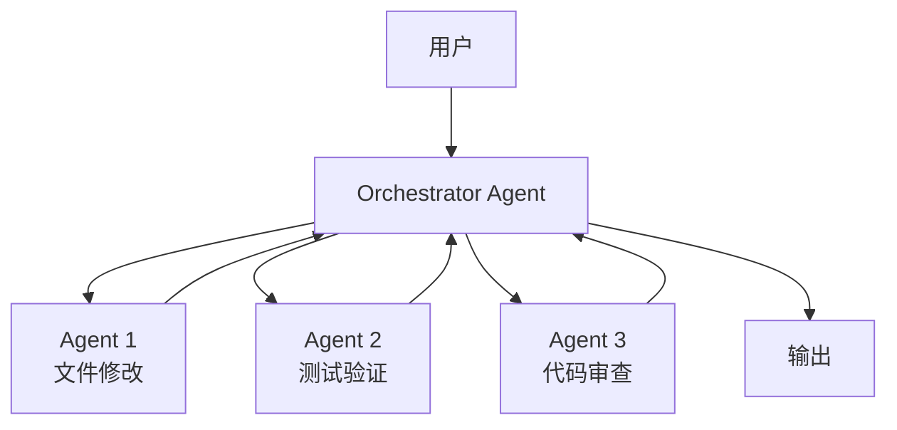
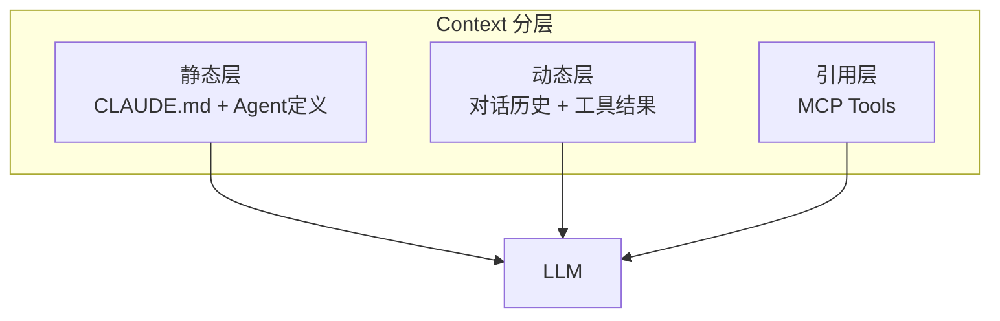
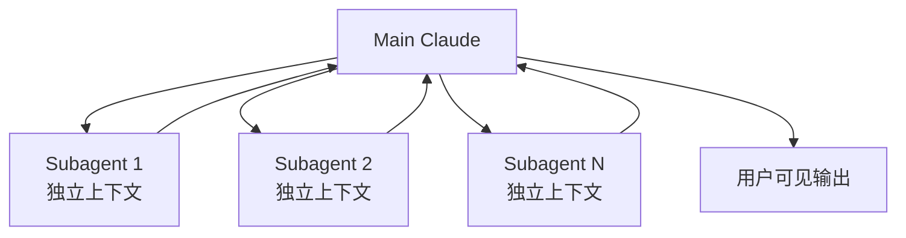
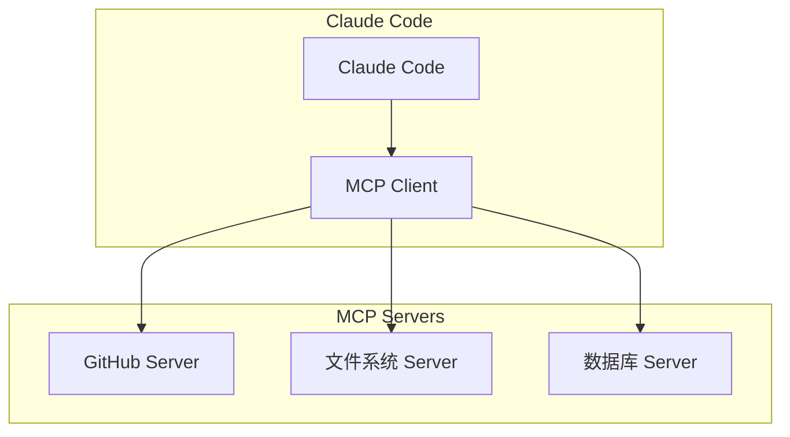

# Claude Code 架构深度解析

> 基于 Anthropic 工程团队访谈《How Claude Code is built》

---

## 一、Claude Code 起源

Claude Code 起源于一个**内部 prototype**，由 Boris Cherny 提出，后来 Sid Bidasaria 作为二号工程师加入，共同创建了 Claude Code subagents 系统。

**核心洞察**：Claude Code 的设计从一开始就把「工程化」而非「演示」作为目标。

---

## 二、核心架构设计

### Agent Teams：多 Agent 协作设计

Claude Code 引入了 **Agent Teams** 架构，每个 Claude 实例作为独立 Agent：



**设计思想**：不是让单一 Agent 做所有事，而是让专业 Agent 做专业事。

---

## 三、Context Management 策略

### 1. Memory Checkpoint

Claude Code 通过 **Memory Checkpoint** 机制维持会话连续性：

| 机制 | 说明 |
|------|------|
| 结构化状态保存 | 会话状态保存到检查点 |
| 上下文持久化 | 服务重启后可恢复 |
| 漂移防止 | 防止长时间对话的上下文漂移 |

### 2. 上下文窗口管理

Claude Code 的 Context 组成：

```
Context Window ≈
├── Custom Agents 定义        ~2.8k tokens
├── CLAUDE.md 文件            ~4k tokens
├── MCP Tools               ~26.5k tokens (13.3%)
├── 当前对话历史             ~变化
└── 工具调用结果            ~变化
```

### 3. 分层策略



---

## 四、Subagent 设计

Claude Code 的 Subagents 是独立的 Claude 实例：



**关键特点**：
- Subagent 有独立 context，不污染主 Agent
- 任务完成后，结果以 summary 形式返回
- 适合复杂任务的并行处理

---

## 五、MCP 集成

Claude Code 通过 **MCP (Model Context Protocol)** 连接外部工具：



**Claude Code 的 MCP 使用方式**：
- 轻量级标识符（文件路径、存储查询）
- 动态加载数据到 context
- 避免全量预加载导致 context 溢出

---

## 六、与传统 IDE 插件的区别

| 维度 | 传统 IDE 插件 | Claude Code |
|------|---------------|------------|
| 交互方式 | 自动完成 | 自主规划 + 执行 |
| 上下文 | 单一文件 | 全代码库 |
| 决策方式 | 规则驱动 | LLM 动态决策 |
| 多步任务 | 不支持 | 支持 |
| 错误恢复 | 固定逻辑 | 自主恢复 |

---

## 七、关键工程决策

### 1. 从 Side Project 到 Production

Claude Code 从一个 side project 演变为生产级工具，核心经验：

> 构建 Agent 时，prompting 和 context engineering 占用了大部分工程时间。

### 2. 安全边界设计

Claude Code 在设计时内置了多层安全边界：

- 沙盒环境测试
- 人工确认检查点
- 操作可回滚

### 3. 可观测性

Claude Code 深度集成 LangSmith，提供完整的 trace 可视化。

---

## 八、关键参考资料

| 来源 | 链接 |
|------|------|
| How Claude Code is Built | https://newsletter.pragmaticengineer.com/p/how-claude-code-is-built |
| Claude Code 官方文档 | https://code.claude.com/docs |
| Claude Code Memory | https://code.claude.com/docs/en/memory |

---

## 九、Claude Code vs 其他 AI 编程工具

| 工具 | 架构 | 多 Agent | Context 管理 |
|------|------|---------|------------|
| Claude Code | Agent Teams | ✅ 原生 | Checkpoint + 分层 |
| Cursor | 单一 Agent | 有限 | 滚动上下文 |
| Copilot | IDE 集成 | ❌ | 有限 |

---

*最后更新：2026-03-21 | 由 OpenClaw 整理*
