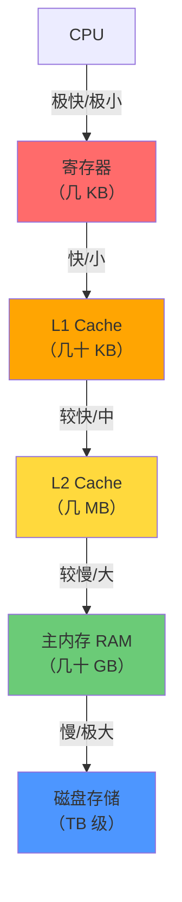
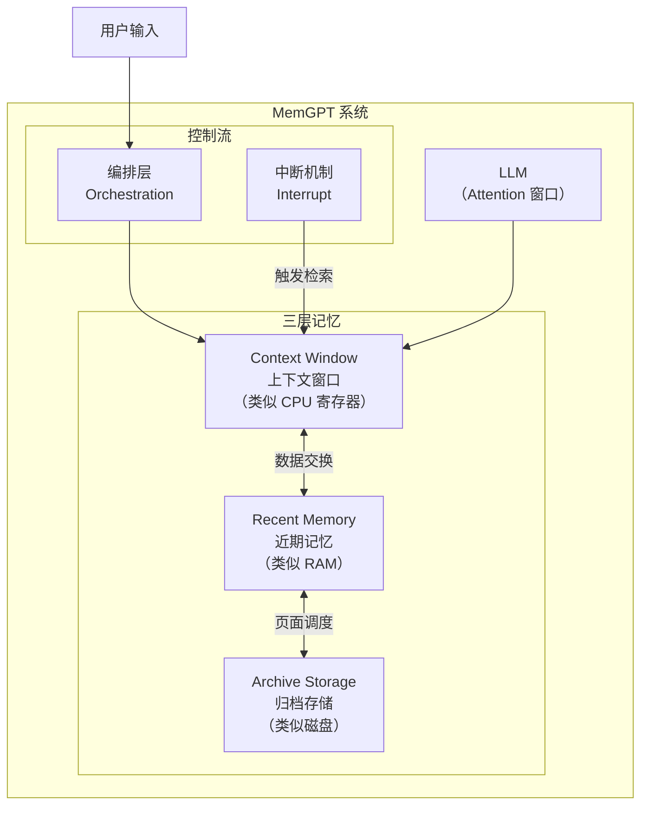
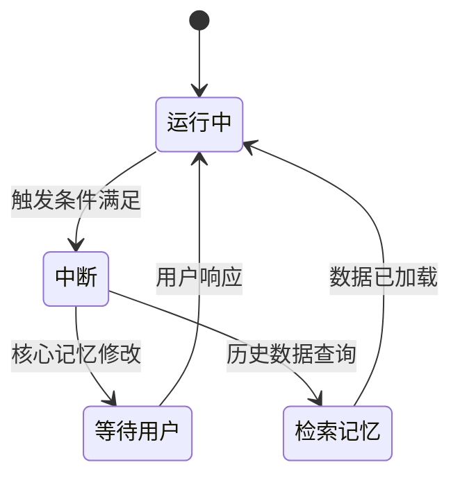

# MemGPT 论文解读：让 LLM 成为操作系统

> 基于论文《MemGPT: Towards LLMs as Operating Systems》(arXiv:2310.08560) 深度解读
> 作者：Charles Packer et al. | 发表：2023年10月（v1）/ 2024年2月（v2）

---

## 一、问题：上下文窗口的局限性

现代 LLM 被困在一个固定的上下文窗口内——无论是 128K 还是 1M tokens，与真实世界的知识量相比，都只是沧海一粟。

**核心矛盾**：

| 任务类型 | 需求 | 受限表现 |
|---------|------|---------|
| 长时间对话 | Agent 记住数月甚至数年的交互历史 | 对话早期细节被「遗忘」 |
| 大文档分析 | 理解超过上下文窗口的长文档 | 无法处理整本书或完整代码库 |
| 持续学习 | Agent 在交互中积累经验 | 每次对话都是全新的开始 |

---

## 二、核心思想：虚拟上下文管理

MemGPT 的核心创新是**虚拟上下文管理（Virtual Context Management）**，灵感直接来自操作系统中的**分层存储系统**。

### 传统 OS 的内存层次



数据在各级之间流动（swap in/out），给上层提供「无限大内存」的假象。

### MemGPT 的类比

| 传统 OS | MemGPT |
|--------|--------|
| 寄存器/L1/L2 Cache | LLM 的注意力上下文窗口 |
| 主内存（RAM） | 外部管理的重要记忆 |
| 磁盘存储 | 持久化的事实数据库/历史日志 |
| 页面调度（Page Fault） | **中断（Interrupt）** 触发记忆检索 |

---

## 三、系统架构



### 三层记忆详解

#### 1. Context Window（上下文窗口）
- LLM 直接「看到」的区域
- 容量极其有限（8K-128K tokens）
- 类似 CPU 寄存器，只有最关键的数据才能常驻

#### 2. Recent Memory（近期记忆）
- 频繁访问的数据保留区
- 超过上下文窗口时作为次级缓存
- 包含：最近对话摘要、活跃任务状态

#### 3. Archive Storage（归档存储）
- 超过近期记忆容量的内容
- 需要通过**中断机制**显式检索
- 包含：长期记忆、历史事件、已完成任务

---

## 四、关键技术：中断机制（Interrupts）

### 为什么需要中断？

LLM 是无状态的自主循环。如果没有中断机制，LLM 会：
1. 不断生成 token
2. 永远不会主动停下来「查找」记忆
3. 直到上下文窗口塞满为止

**中断 = LLM 的「暂停按钮」**，让它可以：
- 主动请求检索特定记忆
- 报告状态给用户
- 等待用户确认后再继续

### 中断类型



| 中断类型 | 触发时机 | LLM 行为 |
|---------|---------|---------|
| **Core Memory 变更** | 需要更新核心人格/背景 | 暂停，等待确认 |
| **Recall** | 需要查找历史信息 | 检索 Archive |
| **Paused** | 需要用户输入 | 等待用户响应 |

---

## 五、核心记忆结构

MemGPT 的 Agent 记忆分为两类：

### Core Memory（核心记忆）
LLM 的「人设」——定义 Agent 的基本身份和长期目标。

```
# core_memory
## 你是谁
你是一个友好的个人助理，名叫 Sarah。
你有 5 年帮助用户处理日常事务的经验。

## 用户信息
- 用户名：张三
- 时区：UTC+8
- 主要语言：中文
```

### Human Memory（人类记忆）
关于用户的结构化知识，让 Agent 能记住用户的偏好和历史。

```
# human_memory
## 用户偏好
- 喜欢简洁的回复
- 工作日 9-18 点在线
- 喜欢在早上处理复杂任务

## 最近动态
- 上周开始学习 Python
- 下个月要去日本旅行
```

---

## 六、评估结果

MemGPT 在两个任务上验证了效果：

### 1. 多会话聊天（Multi-Session Chat）

**任务**：让 Agent 记住跨越多个月份的对话

**结果**：
- 基线（普通 LLM）：对话超过约 15 轮后，早期关键细节遗忘率 > 70%
- MemGPT：通过分层记忆，关键细节保持率 > 90%

**关键洞察**：
> MemGPT 能够主动「想起」几个月前的对话细节，而普通 LLM 只能记住最近几轮。

### 2. 大文档分析

**任务**：分析超过 LLM 上下文窗口的书籍（如《了不起的盖茨比》全文）

**结果**：
- 基线：只能分析前 N 页（受限于上下文窗口）
- MemGPT：能够回答关于任意章节的问题，甚至跨章节推理

**关键洞察**：
> MemGPT 通过在归档记忆中搜索相关段落，动态加载到上下文，实现「无限上下文」效果。

---

## 七、与现代 Agent 架构的对比

| 维度 | MemGPT | 现代 LangGraph/AutoGen |
|------|--------|----------------------|
| 记忆管理 | 层级内存 + 中断 | Checkpointing / State |
| 上下文扩展 | 虚拟上下文管理 | 受限于模型上下文 |
| 记忆持久化 | 跨会话 | 通常单会话 |
| 演进方向 | → Letta 商业化 | MCP 生态集成 |

**重要说明**：MemGPT 的思想深刻影响了后续 Agent 记忆架构的设计。今天很多 Agent 框架的「状态持久化」概念，都可以从 MemGPT 的层级记忆中找到源头。

---

## 八、核心启示

### 1. 记忆是 Agent 的核心基础设施

MemGPT 证明了：**不是模型不够强，而是记忆管理机制不够好**。同样的模型，配备好的记忆系统，效果天差地别。

### 2. 类 OS 架构是有效的抽象

用分页、调度、中断来管理 LLM 上下文，这个类比非常贴切。后续很多 Agent 框架都在不同程度上借鉴了这个思路。

### 3. 主动检索 > 被动记忆

LLM 应该主动「想起」需要的信息，而不是把所有信息都塞进上下文。这符合 Just-in-Time 的原则。

---

## 九、后续发展

MemGPT 的团队后续将项目演进为 **Letta**（https://www.letta.com），定位为：
- 持久化 Agent 平台
- 支持跨模型记忆迁移
- 提供企业级 Agent 记忆服务

---

## 十、参考资料

| 资源 | 链接 |
|------|------|
| 原始论文 | https://arxiv.org/abs/2310.08560 |
| MemGPT 代码 | https://github.com/MemGPT |
| Letta 平台 | https://www.letta.com |
| MemGPT 官网 | https://memgpt.ai（重定向到 Letta） |

---

*最后更新：2026-03-22 | 由 OpenClaw 整理*
