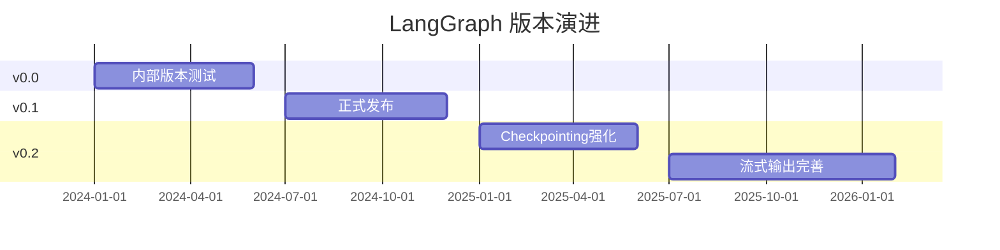

# LangGraph Changelog Watch

> 追踪 LangGraph 版本变化

---

## 更新记录

### 2026-04

**langgraph 1.1.6（2026-04-07）**：
- Patch release，`fix: execution info patching (#7406)`
- `feat(sdk-py): add langsmith_tracing param to runs.create/stream/wait (#7431)`
- SDK 层面 LangSmith tracing 支持强化

**langgraph 1.1.5（2026-04-03）**：
- Patch release，`feat: enhance runtime w/ more...`（runtime 增强）
- CLI 层面 `validate command (#7438)`、`remote build support for langgraph deploy (#7234)`

**langgraph "vigilant mode"（2026-04-07 announced）**：
- 官方发布公告，增强生产工作流的监控与错误处理能力
- 具体技术细节待进一步追踪

**langchain-core 1.2.27（2026-04-07）**：
- Patch release，修复 `deprecated prompt save path` 中的符号链接解析漏洞（安全修复）
- Credit: Jeff Ponte (@JDP-Security) 报告
- pygments>=2.20.0 依赖说明

**langchain-core 1.2.26（2026-04-03）**：
- Patch release，主要为依赖更新（requests 2.32.5→2.33.0）和 model-profiles 数据刷新
- ollama partner 版本 1.1.0，支持 `reasoning_content` 回传
- 无 breaking changes

### ⚠️ 安全：LangChain/LangGraph 漏洞（2026-03，漏登补录）

**LangChain/LangGraph 多个漏洞（The Hacker News，2026-03）**：
- 文件/密钥/数据库暴露类漏洞
- 具体 CVE 待追踪
- 来源：[The Hacker News - LangChain, LangGraph Flaws](https://thehackernews.com/2026/03/langchain-langgraph-flaws-expose-files.html)

### 2026-03

**新特性**：
- 流式输出（Streaming）支持进一步完善
- 深度集成 LangSmith 可观测性
- Checkpointing 性能优化

**生态**：
- LinkedIn AI Recruiter 采用 LangGraph 构建层级 Agent 系统
- Klarna 生产环境稳定运行

**竞争**：
- LangGraph vs LangChain 选型讨论热烈，LangGraph 在生产场景优势明显

### ⚠️ 补充：LangGraph 1.0 GA（2025-10 里程碑，漏登补录）

**发布时间**：2025 年 10 月 22 日

**核心要点**：
- LangGraph 1.0 是** durable agent 框架领域首个稳定主版本**，标志着生产级 AI Agent 系统成熟度的重要里程碑
- LangChain 1.0 同步 GA，承诺在 2.0 之前不引入 breaking changes
- LangGraph 1.0 GA 后，官方将逐步淡化 LangChain 单独版本，LangGraph 成为核心抽象

**LangGraph 1.0 关键变化**：
- `create_agent` 工厂方法正式发布，快速创建 Agent
- Middleware 能力增强（alpha，2025-09）
- Checkpointing 持续优化

**对选型的影响**：
- LangGraph 1.0 GA 确立了"状态机/DAG"作为复杂 Agent 工作流的主流抽象
- 1.0 稳定版意味着 LangGraph 已具备生产级稳定性，值得在生产环境中采用

### 2026-02

**版本**：
- LangGraph 0.1.x 稳定版
- 新增 `create_agent` 工厂方法，快速创建 Agent

**文档**：
- 官方教程更新，包含完整生产案例

---

## 版本趋势

---

## 值得关注的更新

| 版本 | 日期 | 关键变化 |
|------|------|---------|
| 0.1.50+ | 2025-Q4 | `create_agent` 工厂方法 |
| 0.1.40+ | 2025-Q3 | Checkpointing 性能优化 |
| 0.1.30+ | 2025-Q2 | LangSmith 深度集成 |

---

## 参考来源

- [LangGraph Built With](https://www.langchain.com/built-with-langgraph)
- [LangGraph GitHub](https://github.com/langchain-ai/langgraph)

---

*由 AgentKeeper 自动追踪 | 最后更新：2026-04-08*
