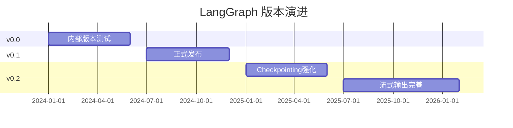

# LangGraph Changelog Watch

> 追踪 LangGraph 版本变化

---

## 更新记录

### 2026-04

**langgraph 1.1.6（2026-04-07）**：
- **正式 release**：`langgraph 1.1.6` + `sdk-py 0.3.12` 同步发布
- `fix: execution info patching (#7406)`
- `chore: validate reconnect url (#7434)`：SDK 层面新增 WebSocket reconnect URL 验证，提高生产环境连接稳定性
- `feat(sdk-py): add langsmith_tracing param to runs.create/stream/wait (#7431)`：runs.create/stream/wait 新增 langsmith_tracing 参数，SDK 层面强化 LangSmith tracing 控制

**langgraph cli 0.4.20（2026-04-08）**：
- **新增 `langgraph deploy --validate` 命令（PR #7438）**：CLI 层面新增 validate 子命令，用于在部署前验证图结构配置是否合法，降低生产环境部署错误率
- 同期 CLI 0.4.19：lockfile 更新（PR #7436）、uv lock 分辨率优化（PR #7342）

**langgraph cli 0.4.x（2026-04-03）**：
- **`langgraph deploy` 新增 remote build 支持（PR #7234）**：部署时支持远程构建，不再依赖本地构建环境，支持 CI/CD 管道中远程构建-部署分离的工作流

**langgraph 1.1.5（2026-04-03）**：
- `feat: enhance runtime w/ more execution information (#7363)`：runtime 新增更丰富的执行信息暴露，支持 LangSmith tracing 粒度增强
- CLI 层面 remote build support for `langgraph deploy`（PR #7234）
- SDK 层面 langsmith_tracing param to runs.create/stream/wait（PR #7431）

**langgraph "vigilant mode"（2026-04-07 announced）**：
- 官方发布公告，增强生产工作流的监控与错误处理能力
- 具体技术细节待进一步追踪

**langchain-core 1.2.27（2026-04-07）**：
- Patch release，修复 `deprecated prompt save path` 中的符号链接解析漏洞（安全修复）
- Credit: Jeff Ponte (@JDP-Security) 报告
- pygments>=2.20.0 依赖说明

**langchain-core 1.2.26（2026-04-03）**：
- Patch release，主要为依赖更新（requests 2.32.5→2.33.0）和 model-profiles 数据刷新
- ollama partner 版本 1.1.0，支持 `reasoning_content` 回传
- 无 breaking changes

### ⚠️ 安全：LangChain/LangGraph 漏洞（2026-03）

**CVE-2026-27794（LangGraph 缓存层 RCE）**：
- 影响版本：< 4.0.0
- 漏洞类型：Remote Code Execution（远程代码执行）
- 场景：启用缓存后端时，LangGraph 缓存层存在 RCE 漏洞
- 修复：4.0.0+ 已修复
- 来源：[NVD CVE-2026-27794](https://nvd.nist.gov/vuln/detail/CVE-2026-27794)

**CVE-2026-28277（LangGraph，CWE-502 反序列化）**：
- CVSS 3.1 评分：6.8 MEDIUM
- 向量：CVSS:3.1/AV:A/AC:L/PR:H/UI:N/S:U/C:H/I:H/A:H
- CWE-502：反序列化问题
- 影响：LangGraph < 某版本（待确认）
- 来源：[NVD CVE-2026-28277](https://nvd.nist.gov/vuln/detail/CVE-2026-28277)，[GitHub Advisory GHSA-g48c-2wqr-h844](https://github.com/langchain-ai/langgraph/security/advisories/GHSA-g48c-2wqr-h844)

**CVE-2026-34070（LangChain Core 路径遍历）**：
- 影响版本：langchain-core < 1.2.22
- 漏洞类型：Path Traversal（路径遍历）
- 根因：`load_prompt()` 及 `load_prompt_from_config()` 函数对嵌入反序列化提示配置字典的文件路径验证不充分
- 受影响函数：` _load_template()`、`_load_examples()`、`_load_few_shot_prompt()`，读取 attacker-controlled 的 `template_path`、`suffix_path`、`prefix_path`、`examples`、`example_prompt_path` 时未阻断绝对路径或 `..`
- 修复：langchain-core 1.2.22 已修复
- 来源：[NVD CVE-2026-34070](https://nvd.nist.gov/vuln/detail/CVE-2026-34070)，[GitHub Advisory GHSA-qh6h-p6c9-ff54](https://github.com/langchain-ai/langchain/security/advisories/GHSA-qh6h-p6c9-ff54)，[Safety DB SFTY-20260327-53300](https://getsafety.com/vulnerabilities/90748)

**概述**：2026年3月底，研究者披露了影响 LangChain 和 LangGraph 的多个漏洞，涵盖 RCE、反序列化绕过和路径遍历，攻击者可借此暴露密钥/数据库/文件系统内容。

### 2026-03

**新特性**：
- 流式输出（Streaming）支持进一步完善
- 深度集成 LangSmith 可观测性
- Checkpointing 性能优化

**生态**：
- LinkedIn AI Recruiter 采用 LangGraph 构建层级 Agent 系统
- Klarna 生产环境稳定运行

**竞争**：
- LangGraph vs LangChain 选型讨论热烈，LangGraph 在生产场景优势明显

### ⚠️ 补充：LangGraph 1.0 GA（2025-10 里程碑，漏登补录）

**发布时间**：2025 年 10 月 22 日

**核心要点**：
- LangGraph 1.0 是** durable agent 框架领域首个稳定主版本**，标志着生产级 AI Agent 系统成熟度的重要里程碑
- LangChain 1.0 同步 GA，承诺在 2.0 之前不引入 breaking changes
- LangGraph 1.0 GA 后，官方将逐步淡化 LangChain 单独版本，LangGraph 成为核心抽象

**LangGraph 1.0 关键变化**：
- `create_agent` 工厂方法正式发布，快速创建 Agent
- Middleware 能力增强（alpha，2025-09）
- Checkpointing 持续优化

**对选型的影响**：
- LangGraph 1.0 GA 确立了"状态机/DAG"作为复杂 Agent 工作流的主流抽象
- 1.0 稳定版意味着 LangGraph 已具备生产级稳定性，值得在生产环境中采用

### 2026-02

**版本**：
- LangGraph 0.1.x 稳定版
- 新增 `create_agent` 工厂方法，快速创建 Agent

**文档**：
- 官方教程更新，包含完整生产案例

---

## 版本趋势

---

## 值得关注的更新

| 版本 | 日期 | 关键变化 |
|------|------|---------|
| 0.1.50+ | 2025-Q4 | `create_agent` 工厂方法 |
| 0.1.40+ | 2025-Q3 | Checkpointing 性能优化 |
| 0.1.30+ | 2025-Q2 | LangSmith 深度集成 |

---

## 参考来源

- [LangGraph Built With](https://www.langchain.com/built-with-langgraph)
- [LangGraph GitHub](https://github.com/langchain-ai/langgraph)

---

*由 AgentKeeper 自动追踪 | 最后更新：2026-04-08*
